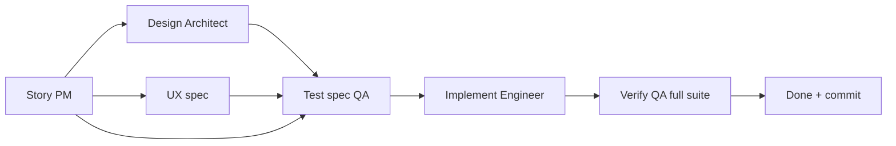

# PodWash dark factory — start here

> **Give this file to a new agent** when you want fresh context without replaying
> the whole conversation. It explains how the factory works, which scripts to run,
> and what a coordinator must do for one slice.
>
> Deeper references (read only when needed):
> - [`multitask-workflow.md`](multitask-workflow.md) — full process, roles, gates
> - [`forge-floor.md`](forge-floor.md) — Floor **Start Forge** / unified `forge.sh`
> - [`slice-runner.md`](slice-runner.md) — queue brain + legacy slice-loop notes
> - [`slice-pipeline.md`](slice-pipeline.md) — gate FSM / Mechanic / Medic
> - [`.cursor/rules/podwash-coordinator.mdc`](../.cursor/rules/podwash-coordinator.mdc) — standing coordinator rules (also always-on in Cursor)

## What “dark factory” means

PodWash is built **verification-first**: a slice is **Done** only when the **full**
automated test suite is green via `scripts/verify.sh` — not when a human listens,
looks, or “tries it on device.”

```
Backlog → In Progress → Verify (full scripts/verify.sh green) → Done (+ auto-commit)
```

**Definition of done (all required):**

1. Every acceptance criterion in the active slice file has a mapped automated test.
2. Unfiltered `scripts/verify.sh` exits **0**, **failed 0**, **skipped 0**.
3. The slice file’s verification record contains the `VERIFY RESULT:` line from that run.
4. Slice `Status` is **Done**.
5. Auto-commit: `slice-NN: <short description>`. Interactive sessions: push when the user asks. Unattended Forge (`forge.sh` / Floor): auto-push on green (disable with `--no-push`).

Humans review strategy and PRs; **no slice completion gate** depends on manual QA.

## Source of truth (don’t load everything)

| Document | Answers |
|----------|---------|
| [`product-requirements.md`](product-requirements.md) | WHAT/WHY — read when the slice references PRD sections |
| [`specs/matching-spec.md`](specs/matching-spec.md) | Exact algorithm — read when porting matcher/interval logic |
| [`docs/slices/slice-NN-*.md`](slices/README.md) | HOW/WHEN for **one** increment — **the active slice file** |
| [`adr/000-foundations.md`](adr/000-foundations.md) | Playback, verification, transcript schema, iOS floor |
| Git commits + green tests | What actually shipped — trust these over chat memory |

**One slice per coordinator session.** Point at **one** slice file; do not paste
the full PRD or all 19 slices into context.

## The three scripts

| Script | Role | When to use |
|--------|------|-------------|
| [`scripts/verify.sh`](../scripts/verify.sh) | **Done / ship gate** — full iOS test suite on Simulator | Every ship; filtered runs are inner-loop only |
| [`scripts/next-work.sh`](../scripts/next-work.sh) | **Unified queue brain** — next task or slice | Between sessions; Floor / `forge_loop` |
| [`scripts/forge.sh`](../scripts/forge.sh) | **Auto driver** — unified tasks + slices via local Cursor SDK | Hands-off: Floor **Start Forge**, or `export CURSOR_API_KEY=…` then `scripts/forge.sh` |

`scripts/slice-loop.sh` is a **deprecated** alias → `forge.sh`. Prefer Floor or `forge.sh`.

### `next-slice.sh` (manual coordinator / per-kind brain)

```bash
scripts/next-slice.sh            # human output + paste-ready prompt
scripts/next-slice.sh --status   # full kanban: ID, Status, DepsMet, BlockedBy
scripts/next-slice.sh --json     # machine output (used by next-work / forge_loop)
```

A slice counts as **Done** for the runner only when **both** are true:

- `| **Status** | Done |` in its slice file
- `VERIFY RESULT: exit=0 … failed=0 … skipped=0` in the verification record

Sequential policy: **lowest eligible slice number** whose dependencies are all Done.

**Halt-and-ask gates** (loop stops; user must decide): slices **11, 13, 15, 17**.

### `forge.sh` (automated factory)

Runs on **your Mac** (local SDK agent) because `verify.sh` needs Xcode + Simulator.
Primary UI: [`scripts/forge-floor.sh`](../scripts/forge-floor.sh) → **Start Forge**.

```bash
export CURSOR_API_KEY=cursor_...   # Dashboard → Integrations

scripts/forge.sh --dry-run    # next decision only; no agent, no key
scripts/forge.sh --max 1      # one item then stop (good first try)
scripts/forge.sh              # drain unified queue (Medic on by default)
```

The loop owns `scripts/verify.sh` as truth and routes red results to Mechanic
fix workers. See [`forge-floor.md`](forge-floor.md) and
[`slice-pipeline.md`](slice-pipeline.md).

Options: `--verbose` (full coordinator text), `--heartbeat 60` (idle ping every N seconds),
`--max-red-verifies 2` (halt after N red verify/xcodebuild outcomes; default 2).

**Progress output (default):** one-line updates tagged with **`[slice NN][Role]`**
(e.g. `[slice 07][QA] verify.sh (full suite) — GREEN — 48/48 passed…`). Subagent
spawns show as `[Coordinator] spawn QA: …` plus `allowed edits: …`; completions show
`[QA] finished — …`. Wrong-role spawns (e.g. UX asked to fix a UI test) log
`⚠ WRONG ROLE`. Idle heartbeat every N seconds (default 90) includes the known
failing test when present (`❌ testName ×N`). A **done banner** prints when
`next-slice.sh` confirms the slice reached Done with green verify, followed by a
**coordinator shift report** (named Forge coordinator — mission, crew, verify).

**Anti-thrash:** after 2 red verify/xcodebuild outcomes in one run, the loop prints
`🛑 HALT` (what failed, why it stopped, next steps) and exits code **5**. Disk work
is preserved — fix with Engineer/QA, then re-run. Do not spawn UX to fix app/tests.

**Known failure:** `Bridge request timed out: ReadTimeout` — the SDK lost contact
during a long subagent stretch; slice is usually still **In Progress**. Re-run
`scripts/forge.sh --max 1` or resume manually (below). `retryable=True` means
safe to retry. On re-run the loop injects a **RESUME** block when status is not
Ready/Draft: audit `git status` + slice artifacts, skip completed gates, continue
from the first incomplete step (usually Engineer/verify).

**Progress label quirk (fixed):** if Architect review and Engineer were spawned
together, older loop builds kept showing `[Architect review]` in heartbeats after
Architect finished while Engineer was still working. Current builds prefer
Engineer/QA when parallel and print `still running: Engineer` when a review ends.

Requires **Python 3.10+** (`cursor-sdk`). macOS `/usr/bin/python3` is often 3.9;
the wrapper auto-picks `python3.13` / `python3.12` if installed.

Details: [`slice-runner.md`](slice-runner.md).

## Starting a **new** coordinator (fresh chat)

### Option A — let the script choose the slice

```bash
scripts/next-slice.sh
```

Paste the printed block into a **new** chat.

### Option B — you name the slice

```
Run Slice NN per docs/slices/slice-NN-<title>.md.
Coordinator: enforce gates per .cursor/rules/podwash-coordinator.mdc and docs/multitask-workflow.md.
Spawn role subagents by name (`podwash-pm`, `podwash-ux`, `podwash-qa`, `podwash-architect`, `podwash-engineer`). Never `composer-2.5-fast` or `grok-4.5-fast-xhigh`.
Done = scripts/verify.sh full suite green + VERIFY RESULT in slice file + Status Done + auto-commit slice-NN: <description>.
If halt-and-ask or PRD §11 is open, STOP and ask the user — never guess.
```

### Option C — unattended Forge

```bash
export CURSOR_API_KEY=cursor_...
scripts/forge.sh --max 1
# or: scripts/forge-floor.sh → Start Forge
```

Do **not** put shell comments on the same line (`# …`) — they get passed as arguments.

## Resuming a **half-finished** slice (same chat or new)

Use when status is **In Progress** / **Verify**, or after a loop timeout:

```
Resume Slice NN per docs/slices/slice-NN-<title>.md.
Read the slice file and current git diff — work is partially landed.
Coordinator: continue enforcing gates; do NOT restart from scratch or touch unrelated slices.
Done = scripts/verify.sh full suite green + verification record + Status Done + auto-commit.
Report what was already done vs what remains before implementing.
```

Check state first:

```bash
scripts/next-slice.sh --status
git status
git log --oneline -5
```

## Coordinator gate pipeline (one slice)



| Gate | Skip when |
|------|-----------|
| Architect ADR | Trivial slice, no new modules |
| UX spec | No new/changed SwiftUI screens |
| PM story / QA test spec / full verify | **Never** |

After Architect lands an ADR: **QA + PM readonly ADR review** (record in slice **Plan review record**).

After QA lands tests: **Architect readonly test-spec review** (record in **Plan review record**).

## Model assignment

| Role | Model | Task / subagent id |
|------|-------|-------------------|
| Coordinator | Composer 2.5 | `composer-2.5` (slice-loop/SDK; bracket syntax not supported) |
| Architect | Grok 4.5 **High** | `podwash-architect` (preferred) or `grok-4.5` |
| Engineer | Grok 4.5 **High** | `podwash-engineer` (preferred) or `grok-4.5` |
| PM | Composer 2.5 | `podwash-pm` (preferred) or `composer-2.5` |
| UX | Composer 2.5 | `podwash-ux` (preferred) or `composer-2.5` |
| QA | Composer 2.5 | `podwash-qa` (preferred) or `composer-2.5` |

**Never** `composer-2.5-fast` (Composer Fast) or `grok-4.5-fast-xhigh` (Grok Fast Extra High).

Project subagents (model pinned in frontmatter): [`.cursor/agents/`](../.cursor/agents/). **Prefer delegating by subagent name** so Cursor does not default to Fast variants.

## What carries forward without bloating context

- Git commits (`slice-NN: …` messages)
- Slice **Status** + **VERIFY RESULT** in `docs/slices/`
- ADRs in `docs/adr/`
- Fixtures in `PodWash/PodWashTests/Fixtures/`
- Green CI from `.github/workflows/test.yml`

## Common mistakes

| Mistake | Fix |
|---------|-----|
| Mark Done on filtered `verify.sh` | Done requires **unfiltered** full suite |
| Start slice 07 before 05 Done | Run `scripts/next-slice.sh --status` |
| XCTSkip on core ACs | Test must **fail**, not skip |
| Regenerate goldens from code under test | Goldens need **independent provenance** |
| Edit tests during verify to go green | Spawn QA with **`readonly: true`**; fix in a separate writable effort |
| Commit app + tests together | Split commits; `scripts/check-test-isolation.sh` fails mixed changes |
| One mega-chat for slices 1–19 | One chat per slice (or resume one slice only) |
| Guess PRD §11 (persistence, monetization, …) | **Halt and ask** the user |
| Spawn UX to "fix" a red UI test | UX is spec-only — spawn **Engineer** (app) or **QA** (tests) |
| Grind the same filtered verify for hours | Loop **halts after 2 red verifies**; fix once, then re-run |

## Quick commands

```bash
# What’s next?
scripts/next-slice.sh

# Full board
scripts/next-slice.sh --status

# Inner loop while implementing (NOT sufficient for Done)
scripts/verify.sh -only-testing:PodWashTests/SomeTests

# Only run that counts for Done
scripts/verify.sh

# Anti-cheat: fail if app + tests changed together
scripts/check-test-isolation.sh --staged
scripts/check-test-isolation.sh HEAD

# Runner tests (no Xcode)
scripts/test-next-slice.sh
scripts/test-check-test-isolation.sh
```

## Related files

- [`slices/README.md`](slices/README.md) — slice index and lifecycle
- [`multitask-workflow.md`](multitask-workflow.md) — kanban order, parallel groups, sizing
- [`slice-runner.md`](slice-runner.md) — JSON contract, exit codes, loop internals
- `.cursor/rules/podwash-*.mdc` — per-role standing rules
