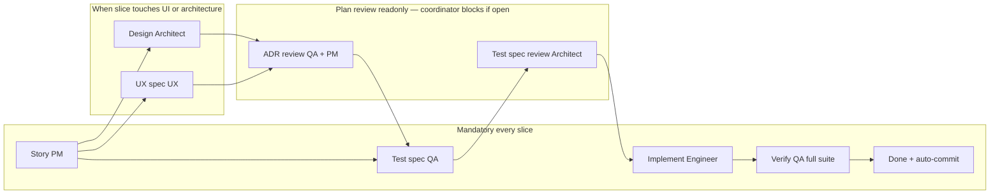

# PodWash Multitask Workflow (iOS Greenfield)

> Guide for building PodWash in Cursor Multitask Mode using vertical slices under a
> **dark factory** model: every slice is done only when its automated test suite is
> green — not when a human manually confirms behavior.
>
> Source of truth: **PRD** = canonical WHAT/WHY ([`product-requirements.md`](product-requirements.md));
> **matching spec** = exact algorithm behavior ([`specs/matching-spec.md`](specs/matching-spec.md));
> **slice files** = canonical HOW/WHEN for delivery ([`docs/slices/`](slices/README.md));
> **ADR-000** = foundational technical decisions ([`adr/000-foundations.md`](adr/000-foundations.md)).

## Dark factory philosophy

PodWash is built **verification-first**. An agent (or developer) implements a slice,
runs `scripts/verify.sh`, and the slice is **done** when the **full suite** passes.
Humans review PRs, strategy, and legal posture — but **no slice completion gate**
depends on manual test cards, listening sessions, or subjective checklists.

| Concept | Dark factory rule |
|---------|-------------------|
| **Definition of done** | Full automated suite green via `scripts/verify.sh` (unfiltered), zero failures, zero skips |
| **Verify column** | `scripts/verify.sh` passes with the `VERIFY RESULT:` artifact recorded in the slice file — not "human pending" |
| **Verification evidence** | Exit code + executed/failed/skipped counts + `.xcresult` path pasted into the slice's verification record; no artifact = not verified |
| **Manual testing** | Optional spot-checks; never a completion criterion |
| **Audio quality** | Offline render + numeric RMS/energy assertions on synthetic fixtures (ADR-000 §2); subjective ear tests are post-MVP automation targets |
| **CI** | Delivered in Slice 1 (`.github/workflows/test.yml`); every slice's tests run in CI from then on |
| **Commits** | **Automatic commit after each completed slice** on green (`slice-NN: <description>`). Interactive: push when the user asks. Unattended `slice-loop.sh`: auto-push on green (`--no-push` to disable) |
| **Skips** | XCTSkip is not allowed on core ACs; `verify.sh` fails the fast suite when skipped > 0 |

## Principles

1. **iOS native only** — Swift/SwiftUI, AVFoundation, on-device ASR. No Python lab,
   no PWA, no React Native.
2. **Vertical slices** — each slice delivers a testable increment, not a horizontal
   layer.
3. **Verification-first (automated)** — every slice has acceptance criteria an
   automated test can confirm, with numeric thresholds where thresholds exist.
4. **Greenfield with a pinned spec** — prototype code is retired; the algorithm is
   ported from [`specs/matching-spec.md`](specs/matching-spec.md), not from memory.
5. **One verification entry point** — `scripts/verify.sh` resolves the simulator
   dynamically, writes `.xcresult` bundles, prints counts, and serializes runs.
   No hardcoded simulator names anywhere.

## Kanban

```
Backlog → In Progress → Verify (scripts/verify.sh full suite green) → Done (+ auto-commit)
```

**Verify column rule:** A slice sits in Verify until the full suite passes and the
verification record is written. Failing or skipped tests block Done — not missing
human approval.

## Kanban dependency order

Slice stories live in [`docs/slices/`](slices/README.md), one file each. Order and
parallel groups:

```
01 Foundation (verify.sh + CI + shared scheme green)
        │
        ├───────────── parallel group A ─────────────┐
        ▼               ▼               ▼             ▼
02 Matching     03 Player shell   05 ASR spike   06 RSS + episode list
        │               │          (early: drives     │
        └──────┬────────┘           iOS floor)        │
               ▼                        │             │
04 Interval mute/skip  ◄── core         │             │
               │        differentiator  │             │
               └──────┬─────────────────┘             │
                      ▼                               │
07 Analyze-episode pipeline                           │
                      ▼                               │
08 Playback integration      09 Analysis UI ◄─────────┘
                      │        (needs 06 + 07)
        ├──────────── parallel group B ───────────────┐
        ▼                      ▼                      ▼
10 Downloads          11 Queue + resume        12 Speed + sleep
 (needs 06)            (needs 03, 06)           (needs 03, 08)
        └──────────────┬──────────────────────────────┘
                       ▼
13 Settings + word lists (needs 02, 11)
                       ▼
14 Lock screen / Control Center / background audio (needs 03, 08)
        │
        ▼
**MVP app shell (user 2026-07-10 — before CarPlay; was "14a/14b"):**
22 Discovery & subscribe (needs 06, 11) → 23 Library & player shell (needs 22, 03, 06, 08, 11, 13)
        │
        ├──────────── parallel group C (after 23) ────┐
        ▼                      ▼                      ▼
15 CarPlay            16 Beep/quack overlay    17 StoreKit
 (needs 11, 14, 22, 23) (needs 08; hard)       (Deferred — free at MVP)

**MVP Differentiator 2 (user 2026-07-10):** 18 Segmentation spike (needs 07; parallel with 22–23) →
19 Segmentation integration (needs 08, 09, 13, 18)
20 Analysis timeline (needs 07, 09, 13) — parallel once deps met; serialize on shared list chrome with 23
21 Visual identity (needs 03, 06) — parallel; serialize if same SwiftUI chrome as 23
```

**Parallel groups:** A = 02/03/05/06 after 01; B = 10/11/12 after 08; **shell = 22→23 after 14**
(before CarPlay); C = 15/16 after **23** Done (17 deferred). Slices **18–21** may parallelize with
22–23 once their own deps are met (serialize on shared `RootView` / list / player files with 23).
Everything else is sequential per the arrows.

## Agent roles and quality gates

### How Multitask Mode works (30-second primer)

One **coordinator** conversation owns the active slice. The coordinator:

1. Reads the active slice file (and PRD/spec sections it references).
2. Spawns **background subagents** with role-specific prompts.
3. Merges their artifacts into the repo.
4. Runs `scripts/verify.sh` (full suite).
5. Moves the slice to **Done** only when automated gates pass, records the
   verification artifact, and **auto-commits** `slice-NN: <description>`.

Roles are **hats worn per slice phase**, enforced by `.cursor/rules/podwash-*.mdc`.

### Session strategy (one slice per chat) — honest version

**One coordinator session per slice.** Be clear about what this means in practice:

> **The user starts each slice.** "Walk away and it builds itself" is true for
> one slice at a time: within a session the coordinator runs the whole
> story → design → test → implement → verify → commit loop unattended, but a
> human opens the next session and points it at the next slice file. Nineteen
> slices ≈ nineteen session starts.

**Next-slice selection (built):** [`scripts/next-slice.sh`](../scripts/next-slice.sh)
is the dependency-aware brain — it reads every slice's status + `## Depends on`
graph and prints the single next eligible slice (or `wait`/`halt`/`done`) with a
copy-paste coordinator prompt. Run it between sessions instead of eyeballing the
kanban. See [`slice-runner.md`](slice-runner.md).

**Optional auto-run (built):** [`scripts/slice-loop.sh`](../scripts/slice-loop.sh)
runs eligible slices sequentially via a **local** Cursor SDK agent. See
[`dark-factory.md`](dark-factory.md) (onboarding) and [`slice-runner.md`](slice-runner.md)
(mechanics). Cloud Automations cannot replace this — they lack Xcode/Simulator for
`verify.sh`.

| Do | Don't |
|----|-------|
| One chat per slice | One mega-session for slices 1–19 |
| Point coordinator at **one** slice file | Paste full PRD + all slices into every chat |
| Open PRD/spec only when the slice references them | Re-read the entire workflow doc every message |
| Close chat when slice is **Done** (auto-commit made) | Keep the same chat across unrelated slices |
| **Resume** the same chat only to fix the current slice before Done | Resume old chats to start the next slice |

**Session start prompt (example):**

```
Run Slice 02 per docs/slices/slice-02-matching-engine.md.
Coordinator: enforce gates, spawn role subagents by name (podwash-pm, podwash-ux, podwash-qa, podwash-architect, podwash-engineer). Never composer-2.5-fast or grok-4.5-fast-xhigh.
Done = scripts/verify.sh full suite green + verification record + auto-commit.
```

**What carries forward without bloating context:** git commits, green tests,
slice status + verification records, ADRs in `docs/adr/`, fixtures in
`PodWash/PodWashTests/Fixtures/`.

### Agent role model

| Role | Responsibility | Primary artifacts | Gate (exit criterion) |
|------|----------------|-------------------|------------------------|
| **PM** | Slice story, acceptance criteria (numeric), out-of-scope | Slice file in `docs/slices/` | Every criterion automatable; thresholds numeric |
| **Architect** | Module boundaries, ADRs consistent with ADR-000 | `docs/adr/` | Design before implementation on architectural slices |
| **UX** | Interaction, a11y identifiers, UI test scenarios, launch-arg fixture modes | UX addendum + scenario list | Spec before UI implementation |
| **Engineer** | Implements to pass existing tests; never bends tests | Swift/SwiftUI code | Code compiles; never marks Done; see `podwash-engineer.mdc` |
| **QA** | Test spec first (author); goldens with independent provenance; **readonly** verify pass | Tests, fixtures; VERIFY RESULT via coordinator if readonly | Full suite green, zero skips, artifact recorded; verifier never edits tests |
| **Coordinator** | Gate order, sizing, halt-and-ask on PRD §11, auto-commit | Slice status, commit | Never Done without QA green |

### Model assignment

Fixed per role — coordinator passes the model when spawning subagents (or uses
project subagents in `.cursor/agents/` where model is pinned in frontmatter):

| Role | Model (display) | Task / subagent id |
|------|-----------------|-------------------|
| **Coordinator** | Composer 2.5 | `composer-2.5` |
| **Architect** | Grok 4.5 **High** | `podwash-architect` (preferred) or `grok-4.5` |
| **Engineer** | Grok 4.5 **High** | `podwash-engineer` (preferred) or `grok-4.5` |
| **PM** | Composer 2.5 | `podwash-pm` (preferred) or `composer-2.5` |
| **UX** | Composer 2.5 | `podwash-ux` (preferred) or `composer-2.5` |
| **QA** | Composer 2.5 | `podwash-qa` (preferred) or `composer-2.5` |

**Never** `composer-2.5-fast` or `grok-4.5-fast-xhigh`. The Cursor **SDK** (slice-loop) must pass `ModelSelection` with `fast=false` (see `scripts/sdk_models.py`) — bare `composer-2.5` / `grok-4.5` strings default to the fast billing variant. IDE subagents may use bracket syntax in frontmatter (`grok-4.5[effort=high,fast=false]`).

**Decision protocol (all roles):** if a slice hits an undecided PRD §11 item
(monetization, persistence, default profile, analysis timing, skip-at-MVP,
CarPlay timing), **halt and surface to the user** — never guess.

### Quality gate pipeline per slice



#### Mandatory vs conditional gates

| Gate | Every slice? | When skipped |
|------|--------------|--------------|
| **Story approved (PM)** | **Yes** | Never |
| **Design approved (Architect)** | No | Trivial slices with no new modules |
| **ADR plan review (QA + PM, readonly)** | No | When Architect gate is waived |
| **UX spec + UI scenarios (UX)** | No | No new/changed SwiftUI screens |
| **Test spec before implement (QA)** | **Yes** | Never |
| **Test spec plan review (Architect, readonly)** | **Yes** | Never — even when Architect gate was waived |
| **Full suite green + artifact (QA)** | **Yes** | Never — this is Done |
| **Auto-commit on green (Coordinator)** | **Yes** | Interactive: push when asked. Unattended loop: auto-push (`--no-push` to disable) |

### Plan review gates (upstream quality)

`scripts/verify.sh` is the **downstream** arbiter — it catches wrong implementation,
not wrong plans. Slice 04 showed that flawed ADRs and fixture assumptions can burn a
full red loop before tests fail. These **readonly review beats** run **after the
author lands an artifact** and **before the next role starts**. The coordinator
records the outcome in the slice file's **Plan review record** (see slice template).

**Rules:**

- Review subagents are **readonly** — list findings only; they do not edit ADRs,
  tests, slice status, or AC thresholds. Author revises; coordinator re-runs review
  if blockers were raised.
- **No recorded plan review = do not spawn the next downstream role** (same
  discipline as missing `VERIFY RESULT:`).
- Waive ADR review only when the Architect gate is waived (trivial / test-only slice).
  **Test-spec review is never waived** — even trivial slices need Architect (or
  coordinator acting as reviewer) to confirm tests match the public API under test.

#### Beat 1 — After Architect ADR (before QA test spec)

Spawn **two readonly subagents** (can run in parallel):

| Reviewer | Lens | Block if… |
|----------|------|-----------|
| **QA** | Testability | Any AC cannot be asserted offline; fixture/provenance is fragile or circular; harness assumptions contradict ADR-000 |
| **PM** | Story alignment | ADR changes scope vs slice AC/out-of-scope; AC wording will be fragile; crux is no longer one hypothesis |

**Empirical spike requirement:** when the ADR claims behavior of a **framework or
renderer** (audio mix, ASR, StoreKit, CarPlay, networking, HLS), the ADR must
include measured validation or an explicit spike step **before** QA writes tests.
Slice 04 ADR-002 Revision is the template. QA review **blocks** if audio/framework
claims lack empirical backing.

Coordinator records: `ADR review: QA cleared / PM cleared` or lists open blockers.

#### Beat 2 — After QA test spec (before Engineer)

Spawn **one readonly subagent**:

| Reviewer | Lens | Block if… |
|----------|------|-----------|
| **Architect** | Contract fidelity | Tests call APIs the ADR does not specify; harness measures something the design cannot guarantee; thresholds assume behavior the ADR flags as uncertain |

Waive only when there is **no ADR** (Architect gate waived) — then the coordinator
performs the same checklist against the slice deliverables and ADR-000.

Coordinator records: `Test spec review: Architect cleared` or lists open blockers.

#### Plan review record (coordinator writes in slice file)

```markdown
## Plan review record

ADR review (YYYY-MM-DD): QA cleared — …; PM cleared — …
Test spec review (YYYY-MM-DD): Architect cleared — …
```

If waived, state why: `ADR review: waived (no new modules)`.

### Dark factory alignment

| Quality concern | Enforcement (not "human likes it") |
|-----------------|-------------------------------------|
| Requirements clear | Written story; `[ ]` criteria with test mapping; numeric thresholds |
| Design sound | ADRs + **readonly plan review** before QA/Engineer; compiler + unit tests enforce boundaries |
| UX good enough | UI tests assert identifiers/values/states; a11y identifiers on every control |
| Implementation correct | Full suite green via `scripts/verify.sh` |
| Audio behavior | Offline render + RMS assertions (ADR-000 §2) — not listening sessions |
| Goldens trustworthy | Documented independent provenance; never regenerated from code under test |
| Verification honest | `VERIFY RESULT:` artifact in the slice file; skipped = 0; **QA verify is readonly**; `scripts/check-test-isolation.sh` bans app+tests in one commit |

### Parallel agent orchestration

Safe in parallel: QA test skeleton ∥ Architect layout; UX spec ∥ PM refinement;
**ADR plan review (QA ∥ PM)** after Architect lands.
Must be sequential: Story → Design/UX → **ADR plan review** → Test spec →
**Test spec plan review** → Implement → Verify → Done.
When parallel agents touch the same file, the coordinator serializes the merge —
never two agents editing one Swift file at once.

### Prompt templates (Multitask Mode)

**PM**

```
You are the PM agent for PodWash Slice NN. Read docs/slices/slice-NN-*.md and the
PRD/spec sections it references. Write/refresh the story: crux, deliverables,
automated acceptance criteria with numeric thresholds, out-of-scope, verification
commands referencing scripts/verify.sh. No manual listening or visual review.
```

**Architect**

```
You are the Architect agent for PodWash Slice NN. Propose module boundaries, key
types, and tradeoffs consistent with docs/adr/000-foundations.md. Output: design
note or ADR + file list. Do not implement. Flag cross-cutting impact.
```

**UX**

```
You are the UX agent for PodWash Slice NN. Specify states, accessibility
identifiers, launch-argument fixture modes, and numbered UI test scenarios
automatable in PodWashUITests. Prefer discrete controls over slider scrubs.
No implementation.
```

**Engineer**

```
You are the Engineer agent for PodWash Slice NN. Implement against the approved
story and QA test spec, porting algorithm behavior from docs/specs/matching-spec.md
where referenced. Never edit test assertions, thresholds, goldens, or slice status.
If a test seems wrong, stop and report. Run scripts/verify.sh before handing back.
```

**QA**

```
You are the QA agent for PodWash Slice NN. Map each acceptance criterion to a test.
Write tests and fixtures FIRST; goldens need documented independent provenance.
No XCTSkip on core ACs. Do not edit production app code.
```

**QA — verify pass (readonly; spawn after Engineer, before Done)**

```
You are the QA verifier for PodWash Slice NN (READONLY — coordinator must set
readonly: true). Run scripts/verify.sh (full suite). Report the VERIFY RESULT
line and any failures with file:line. Do NOT edit tests, fixtures, thresholds,
goldens, or app code. If the suite is red, stop and report — Engineer or
QA-author fixes in a separate writable effort.
```

**QA — ADR plan review (readonly; spawn after Architect, before you write tests)**

```
You are the QA agent reviewing an Architect ADR for PodWash Slice NN (READONLY).
Read the ADR, the slice ACs, and ADR-000 verification rules. Do NOT edit any files.
List: (a) assumptions that cannot be asserted offline, (b) fixture/provenance risks,
(c) AC wording fragile under real framework behavior, (d) missing empirical
validation for audio/ASR/StoreKit/CarPlay/network claims. Label each finding
blocker vs recommendation. Block downstream if any blocker remains.
```

**PM — ADR plan review (readonly; spawn after Architect, parallel with QA review)**

```
You are the PM agent reviewing an Architect ADR against the slice story (READONLY).
Read the ADR and docs/slices/slice-NN-*.md. Do NOT edit any files.
List: (a) scope drift vs deliverables/out-of-scope, (b) AC wording that should be
pinned or clarified, (c) crux no longer single-hypothesis. Label blocker vs
recommendation. Block downstream if any blocker remains.
```

**Architect — test spec plan review (readonly; spawn after QA test spec, before Engineer)**

```
You are the Architect agent reviewing QA's test spec for PodWash Slice NN (READONLY).
Read the test files, harness, fixtures, and the ADR (or ADR-000 if no slice ADR).
Do NOT edit any files. Confirm tests exercise the ADR's public API and harness
contract; flag tests that assume behavior the design does not guarantee. Label
blocker vs recommendation. Block Engineer if any blocker remains.
```

### Cursor rules (standing guidance)

| File | Applies | Role |
|------|---------|------|
| `podwash-coordinator.mdc` | **Always** (`alwaysApply: true`) | Pipeline, gates, auto-commit, halt-and-ask, verification evidence |
| `podwash-pm.mdc` | `docs/slices/**`, PRD | Story + numeric automatable criteria |
| `podwash-qa.mdc` | test dirs + `docs/slices/**` | TDD, goldens provenance, no-skip policy, verify.sh execution |
| `podwash-architect.mdc` | `docs/adr/**`, `docs/slices/**` | ADRs before architectural slices |
| `podwash-ux.mdc` | `docs/slices/**`, `PodWash/PodWashUITests/**` | UX spec + UI scenarios before screens |
| `podwash-engineer.mdc` | `PodWash/PodWash/**` | Implementation discipline: never bend tests/goldens/status |

Rules are scoped so Engineers editing Swift source get the Engineer rule (not the
Architect's "MUST NOT implement"), and doc editors get PM/Architect/UX rules.

### Slice phase checklist (coordinator)

- [ ] **PM:** Story written; criteria automatable + numeric; out-of-scope listed
- [ ] **Halt-and-ask:** No undecided PRD §11 item silently assumed
- [ ] **Architect:** Design note/ADR (if architectural slice)
- [ ] **Plan review 1:** ADR reviewed by QA + PM (readonly); record in slice file; blockers resolved
- [ ] **UX:** Spec + UI scenarios (if UI slice)
- [ ] **QA:** Test spec mapped to criteria; goldens have provenance
- [ ] **Plan review 2:** Test spec reviewed by Architect (readonly); record in slice file; blockers resolved
- [ ] **Engineer:** Implementation complete; no test/threshold edits
- [ ] **QA (readonly):** `scripts/verify.sh` full suite green, zero skips; `VERIFY RESULT:` recorded (spawn with `readonly: true`)
- [ ] **Isolation:** no commit mixes `PodWash/PodWash/**` with test targets (`scripts/check-test-isolation.sh`)
- [ ] **Coordinator:** Status → Done; auto-commit `slice-NN: <description>`

## Process: verification, sizing, authorship

| Term | Meaning |
|------|---------|
| **Slice** | Vertical crux deliverable (Backlog → Verify → Done) |
| **Story** | PM-authored slice document (`docs/slices/slice-NN-*.md`) |
| **Ticket** | Optional PM breakdown *within* a slice — exception, not routine |
| **Effort** | Single subagent delegation |

### Tickets within slices

Default: crux-sized slices do **not** need sub-tickets. Use them only when parallel
workers need non-overlapping packages in the same slice. If PM routinely needs
tickets, split the slice.

### Who reviews verification

| Level | Criteria review | Plan review | Execution review | Process review |
|-------|-----------------|-------------|------------------|----------------|
| **Slice** | PM (story gate); QA (test-spec gate) | **QA + PM** (ADR, readonly); **Architect** (test spec, readonly) | **QA (readonly)** — runs `scripts/verify.sh`, confirms mapping + artifact; never edits tests to go green | **Coordinator** — gate order, plan review recorded, isolation commits, no Done without QA green |
| **Story** | **PM** — rewrites vague criteria, numeric thresholds | PM lens on ADR alignment | **QA** — rejects unmappable criteria | **Coordinator** — story exists before workers spawn |
| **Effort** | Parent story + test spec | Reviewer role per beat | **QA** — verifies output against mapped tests | **Coordinator** — no skipping ahead |

### Slice sizing (crux-only)

Every slice proves **one hypothesis** with the smallest automated proof.

**Sizing checklist** (Coordinator, before spawning workers):

- [ ] Single crux statement — no compound "and also"
- [ ] Tests prove one behavioral claim
- [ ] Fits one PR
- [ ] Out-of-scope explicit
- [ ] Dependencies honest

| ❌ Too large | ✅ Right-sized |
|-------------|----------------|
| "Downloads, queue, speed, sleep timer, settings" | Slices 10 / 11 / 12 / 13 — one crux each |
| "E2E pipeline + progress UI + playback wiring" | Slices 07 / 08 / 09 |
| "Lock screen + CarPlay" | Slice 14 / Slice 15 |

### Who writes slices

| Who | Responsibility |
|-----|----------------|
| **PM Agent** | Creates/updates `docs/slices/slice-NN-*.md` |
| **Coordinator** | Story gate before Engineer; sizing checklist; halt-and-ask; auto-commit |
| **User (Bryce)** | Starts each session; decides PRD §11 items when slices hit them |
| **Architect / UX** | Addenda only when their gates apply |
| **QA** | Verification mapping + execution + record |

## First recommended slice (start here)

**Slice 01 — Foundation** ([`slices/slice-01-foundation.md`](slices/slice-01-foundation.md)).
The Xcode project already exists (user-created); this slice proves the
verify.sh + CI loop and replaces template tests. Everything else is blocked on it.

## Verification commands (all slices)

```bash
# Full suite — the only run that can mark a slice Done:
scripts/verify.sh

# Fast inner loop during implementation (never sufficient for Done):
scripts/verify.sh -only-testing:PodWashTests/SomeTests

# Slow suite (nightly CI or manual; ASR benchmarks etc.):
VERIFY_ALLOW_SKIPS=1 scripts/verify.sh -only-testing:PodWashSlowTests
```

`scripts/verify.sh` picks an available iPhone simulator dynamically, retries flaky
failures once, writes `build/test-results/verify-<timestamp>.xcresult`, prints
executed/failed/skipped counts, fails on skips (fast suite), and emits the
`VERIFY RESULT:` line QA pastes into the slice file.

CI (`.github/workflows/test.yml`) runs the full fast suite on every push and a
nightly/manual slow job.

## Slice done checklist

A slice moves to **Done** only when **all** items are true:

- [ ] Every acceptance criterion has a corresponding automated test.
- [ ] **Full suite** `scripts/verify.sh` exits 0 locally — zero failures, zero skips.
- [ ] `VERIFY RESULT:` artifact recorded in the slice file.
- [ ] New tests run in CI (fast job), or live in `PodWashSlowTests` with the nightly job.
- [ ] No criterion requires manual listening, visual inspection, or "try on device."
- [ ] Fixtures committed (small, with provenance) or documented (large/gitignored).
- [ ] PRD open decisions updated if the slice resolves a TBD.
- [ ] **Auto-commit made:** `slice-NN: <short description>` (interactive: push when asked; unattended loop: auto-push unless `--no-push`).

## Git commit strategy

- **Split app vs tests (anti-cheat):** a single commit must not change both
  `PodWash/PodWash/**` and `PodWash/{PodWashTests,PodWashUITests,PodWashSlowTests}/**`.
  Prefer `slice-NN: test spec` (tests/fixtures) then `slice-NN: implement` (app).
  Docs/status/VERIFY RESULT may ride either commit. Enforce locally with
  `scripts/check-test-isolation.sh --staged`; CI runs the same check on every push.
- **QA verify is readonly:** after Engineer, spawn `podwash-qa` with `readonly: true`
  so the agent that declares green cannot weaken tests.
- **Automatic commit after each completed slice**, made by the coordinator the
  moment the full suite is green and the verification record is written.
- Message format: `slice-NN: <short description>` (e.g. `slice-02: matching engine`).
- Never commit a red or unverified slice. **Push only when the user explicitly asks.**
- Do not commit large binaries (audio > ~1 MB, ASR models) — `scripts/setup-asr-models.sh`
  handles models; fixture provenance docs handle large audio.
- Spike branches may squash-merge when the decision ADR lands.

## Non-automated concerns (not slice gates)

| Concern | When | Notes |
|---------|------|-------|
| Apple Developer account | Device builds, TestFlight | Not Slice 01 |
| Attorney review | Before App Store launch | PRD §8; skip/unrelated feature framing |
| TestFlight beta | Post–Slice 17 | Optional real-user feedback |
| App Store review | Ship | Policy + metadata |
| Perceptual audio QA | Post-MVP | Offline-render RMS covers the automated part |
| CarPlay head-unit check | Slice 15 ships on doubles | Manual spot-check only, never a gate |

## Retired artifacts

Intentionally deleted; must not be recreated as code (the algorithm survives as
[`specs/matching-spec.md`](specs/matching-spec.md)):

- Python prototype (`podwash.py`, `app_server.py`, `requirements.txt`)
- PWA spike (`pwa-spike/`), static web lab (`static/`), seeds (`seeds/`)
- Archived plans (`docs/archive/`, `docs/pwa-playback-spike-plan.md`)
