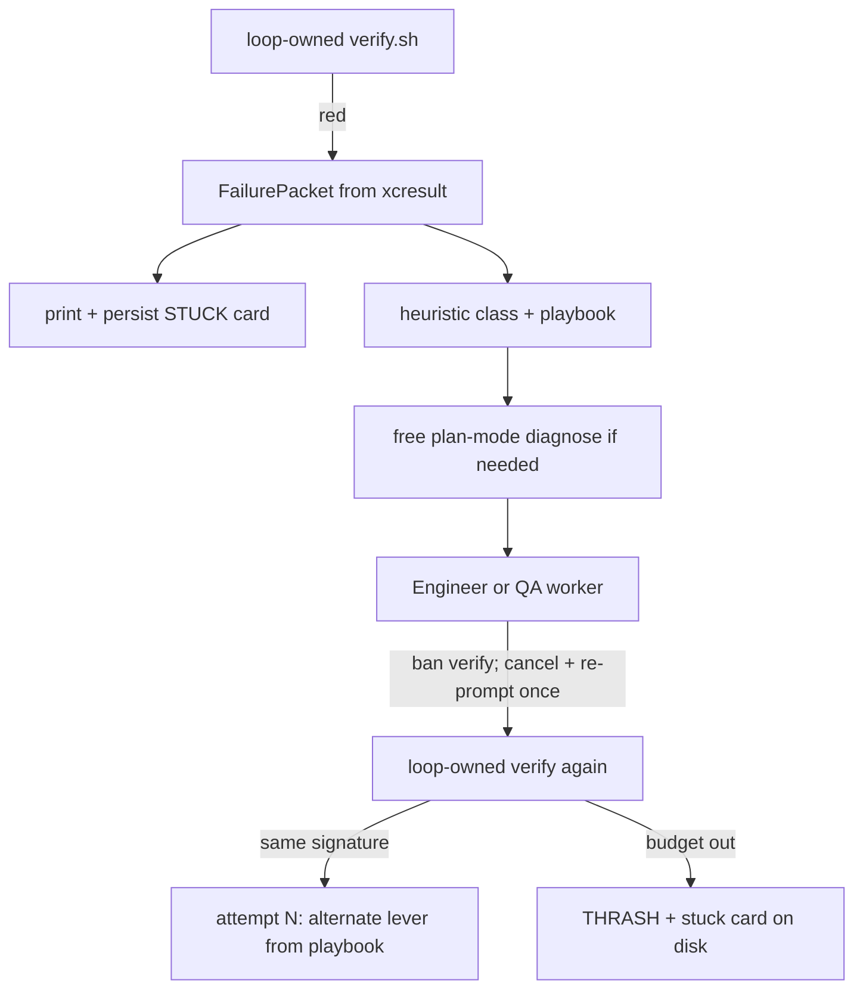

# Factory fix confidence (diagnose → fix → playbooks)

> **For the next agent:** implement in **mergeable phases** — land **P0 first**, then P1, then P2. Do **not** fix Slice 09 app Swift here — factory only. After P0+ (ideally full stack) merges, a Slice 09 loop re-run is the confidence check.
>
> Related: [`loop-as-orchestrator-refactor.md`](loop-as-orchestrator-refactor.md), [`../slice-pipeline.md`](../slice-pipeline.md).
> Primary code: [`scripts/slice_pipeline.py`](../../scripts/slice_pipeline.py), [`scripts/slice_loop_progress.py`](../../scripts/slice_loop_progress.py).
> Applies to **both** coordinator and pipeline modes — both use [`run_fix_loop`](../../scripts/slice_pipeline.py).

## Problem (from Slice 09)

Anti-thrash works (halt after 2). Resolution does not:

- First fix attempt saw `failures=['xcodebuild — TEST FAILED']` — no test name, assertion, or hierarchy.
- Evidence already lived in xcresult attachments (`analysisProgress` query failed; hierarchy showed `cleaningBadge_episodeOn` already on).
- Fix workers were labeled `[Coordinator]`; QA ran `xcodebuild test` and tripped the legacy red-verify halt.
- Attempt 2 re-explored instead of building on attempt 1.



## Scope (locked)

**In:** P0 + P1 + P2 factory changes in [`scripts/slice_pipeline.py`](../../scripts/slice_pipeline.py), [`scripts/slice_loop_progress.py`](../../scripts/slice_loop_progress.py), optional new `scripts/failure_packet.py` / `scripts/fix_playbooks.py`, unit tests per phase, docs.

**Out:** Slice 09 app/UITest production fix; deleting the coordinator orchestrator path; deep per-tool sandboxing beyond verify-ban + `mode=plan` for diagnose.

**Delivery:** Prefer three PRs / landable commits (P0, P1, P2). Do not require one agent to finish the whole stack before merging P0.

**Success bar:**

1. After a red verify, logs **and** `build/test-results/stuck-slice-NN.txt` show a stuck card with real test id + assertion + hierarchy clue (when available).
2. Engineer/QA prompts contain the FailurePacket + playbook lever for this attempt.
3. Workers that run `verify.sh` / `xcodebuild … test` are cancelled and re-prompted once; they cannot steal thrash accounting. A second violation burns the attempt.
4. Attempt 2 cites attempt 1 and uses the playbook’s **alternate lever** (stable signature from `test_ids`).
5. Slice 09 re-run is a fair test of whether the factory can fix the race (not guaranteed green, but no longer blind).

---

## Phase A — FailurePacket + stuck card + verify ban (P0)

### A0. Attachment-export spike (do first; document in code comments)

A1’s attachment path is the highest implementation risk across Xcode / `xcresulttool` versions. Before wiring the full packet:

1. Spike one concrete export path against a real Slice 09 (or synthetic) `.xcresult`:
   - Prefer: `xcrun xcresulttool get test-results …` / export attachments to a temp dir or `build/test-results/attachments-<hash>/`.
   - Record the exact argv that works on the current Xcode; if the CLI shape differs, wrap behind one helper with a version fallback.
2. Document truncate rules (e.g. hierarchy ≤ 4k chars; keep lines mentioning failing identifiers / query chains).
3. **Fallback when attachments are empty:** still build a packet from summary `testFailures` + shell `raw_failures` + crashes. Never leave the prompt as only `xcodebuild — TEST FAILED` when the summary has names.

### A1. `FailurePacket` builder

Prefer a dedicated module [`scripts/failure_packet.py`](../../scripts/failure_packet.py) if `slice_pipeline.py` stays large; otherwise keep in pipeline.

```python
@dataclass
class FailurePacket:
    test_ids: list[str]          # e.g. PodWashUITests/testProgressIndicatorLifecycle()
    assertions: list[str]        # failureText / XCTAssert message
    hierarchy_excerpt: str       # truncated AX dump if present
    failed_queries: list[str]    # e.g. "analysisProgress" IN identifiers
    bundle: str | None
    crashes: list[str]
    signature: str               # see A1b — stable, not raw failure text
    raw_failures: list[str]
    exit_code: str | None = None
    failure_class: str = "unknown"   # filled by classifier (P1+)
    hypothesis: str = ""
    fix_scope: str = "app"           # app | tests
    suggested_files: list[str] = field(default_factory=list)
```

Build from:

1. Existing [`read_failures_from_xcresult`](../../scripts/slice_loop_progress.py) / summary `testFailures` — **must never** fall back to only `xcodebuild — TEST FAILED` when summary has names.
2. Attachment helper from A0.
3. Prefer attachment lines that look like query chains or hierarchy identifiers relevant to the failing test.

Wire into [`run_verify`](../../scripts/slice_pipeline.py): populate `VerifyOutcome` with `packet: FailurePacket | None`.

#### A1a. Soft undiagnosable (do **not** hard-halt all “no test id”)

Compile failures, verify lock contention, and parse-only reds often have no `testFailures`. Hard-halting those would block the future `build_error` path.

| Condition | Action |
|-----------|--------|
| Bundle missing **and** no actionable `raw_failures` / crashes / exit signal | Log `DIAGNOSE FAILED: no actionable evidence`; **halt** — do not spawn a fix worker |
| No `test_ids`, but shell/exit looks like **build / compile / lock** | Emit stuck card with `raw_failures` + exit + bundle (if any); route **Engineer** (P0) / class `build_error` once P2 lands |
| No `test_ids`, sparse shell, but bundle exists | Still try summary + attachments; if still empty, stuck card + Engineer with “inspect bundle / minimal change” |
| Has `test_ids` | Normal fix path |

#### A1b. Stable `failure_signature`

Replace (or wrap) today’s truncated-string signature so lever advance stays stable once attachments enrich prompts:

- Primary: sorted unique `test_ids` (normalized).
- Plus: crash fingerprint (IPS basename / exception type) when present.
- Do **not** include hierarchy excerpts or full assertion text in the signature (those jitter across runs).

`FixBudget` / “same signature → lever 2” must use this packet signature.

### A2. Stuck card

`format_stuck_card(packet, *, attempt, max_attempts, last_role, class_)` prints and returns text like:

```text
STUCK — Slice 09
Test: PodWashUITests/testProgressIndicatorLifecycle()
Assert: analysisProgress should appear / XCTAssertTrue failed
Got: cleaningBadge_episodeOn present; analysisProgress query empty
Class: ui_race
Lever: hold analyzing state ≥ observable window (app)
Attempt: 1/2 · next role: Engineer
```

- Print after every red loop-owned verify and on thrash halt.
- **Persist** the same text to `build/test-results/stuck-slice-NN.txt` (overwrite per red) so the next human/agent does not need log archaeology.
- Embed the same text in fix prompts.

### A3. Ban verify inside fix workers

In [`run_worker`](../../scripts/slice_pipeline.py) / `RunProgress` for fix runs:

- Prompt says do not verify; **enforce** via [`is_verify_run`](../../scripts/slice_loop_progress.py).
- On first violation: log `WORKER VIOLATION: verify owned by loop`, cancel if `run.supports("cancel")`, **do not** burn the fix attempt yet — **one same-attempt re-prompt** (“violation; do not run verify/xcodebuild test; continue the fix”).
- On second violation in the same attempt (or if cancel/re-prompt is impossible): count the attempt as used, continue to loop-owned verify (or halt if budget exhausted).
- Disable legacy `_record_red_verify` thrash counting on fix-worker `RunProgress` (`max_red_verifies=0` or `fix_worker=True`) so worker-side xcodebuild cannot steal the outer halt path.

### A4. Honest worker labels

When `progress_factory(role)` creates `RunProgress` for a fix worker, seed optional `forced_role=` so logs show `[Engineer]` / `[QA]`, not `[Coordinator]`. Use in `active_role()` when no Task tool is open.

### A5. Prompt upgrade

Replace thin [`build_fix_prompt`](../../scripts/slice_pipeline.py) with packet + stuck card + (P0: empty/stub lever) + edit scope + “do not verify.”

### A6. P0 tests + docs (land with P0)

- Packet from synthetic summary JSON + fake attachment text → stuck card contains test id.
- Sparse shell + rich xcresult summary → never prompt-only `xcodebuild — TEST FAILED` when summary has names.
- Soft undiagnosable: build-ish red without test id still produces a card and routes Engineer (does not hard-halt).
- Hard halt only when no actionable evidence.
- Signature stability: hierarchy/assertion text changes do not change signature when `test_ids` match.
- Verify-ban: first violation → re-prompt path; second → attempt burned; nested thrash disabled.
- Docs: expand [`docs/slice-pipeline.md`](../slice-pipeline.md) for FailurePacket, stuck card (print + persist), verify ban. Link from [`loop-as-orchestrator-refactor.md`](loop-as-orchestrator-refactor.md).

**Merge P0 before starting P1.**

---

## Phase B — Classify, diagnose, attempt memory (P1)

### B1. Failure classes (heuristic)

Classifier on `FailurePacket` (Python, no LLM required):

| Class | Signals |
|-------|---------|
| `crash` | IPS / Crash: lines |
| `ui_race` | UITest + progress/appear/disappear/timeout language OR hierarchy shows post-success state while expected transient id missing |
| `missing_identifier` | query for id fails and hierarchy lacks that id entirely with no “already done” badge |
| `assertion` | unit-test XCTAssert without UI hierarchy |
| `build_error` | no test id + compile/linker/lock language in `raw_failures` / exit (P0 already routes Engineer; name the class here) |
| `unknown` | else |

(P2 expands with `flake`, `wrong_state`, and full levers.)

### B2. Readonly diagnose step (free — does **not** burn fix budget)

Before a fix attempt when:

- heuristic `class == unknown`, **or**
- attempt 1 for UITest failures, **or**
- heuristic `class == assertion` (so scope is not circular with “diagnose picks scope”),

then:

- Spawn one SDK worker with `mode=plan`, role `QA review` (or dedicated diagnose prompt), input = FailurePacket + stuck card.
- Require a short structured reply (parse from assistant text): `class`, `hypothesis`, `fix_scope` (`app`|`tests`), `suggested_files`.
- **Budget:** diagnose is **free** — does **not** increment `--max-fix-attempts`. With default budget 2, a paid diagnose would waste the run.
- **Merge policy (heuristic wins unless unknown):**
  - If heuristic class is **not** `unknown`, keep heuristic `failure_class`; still accept diagnose `hypothesis`, `fix_scope`, and `suggested_files` when parse succeeds.
  - If heuristic is `unknown`, allow diagnose to set `failure_class`.
  - If parse fails, keep heuristic class and proceed (do not stall the whole budget on diagnose failure).

### B3. Routing by class + attempt memory

Update [`route_fix`](../../scripts/slice_pipeline.py) / `FixBudget`:

- `crash` / `ui_race` / `missing_identifier` / `build_error` → Engineer first.
- `assertion` → use diagnose (or non-LLM) `fix_scope`: `tests` → QA first, `app` → Engineer first. If diagnose skipped/failed, default Engineer then opposite role on same signature.
- Same signature after first role → opposite role (keep), but prompt must include **AttemptHistory**: role, files touched (from tool stream if available), prior hypothesis, “still same packet.”
- Store on `FixBudget`: `last_packet`, `last_class`, `last_hypothesis`, `attempt_notes: list[str]`, `last_lever_index: int`.

### B4. Starter playbook lines + slice-derived files (bridge to P2)

Hard-code short snippets until P2 data file lands:

- `ui_race`: hold analyzing / defer completion; do not weaken the test.
- `crash`: parse IPS; fix app; do not edit tests.
- `missing_identifier`: wire accessibilityIdentifier named in the query.
- `build_error`: fix compile in the failing target; do not edit tests unless error is in a test target.

**Slice-derived `suggested_files` (promote from former C4 — land in P1):** when the slice file Role artifacts / Deliverables list Swift paths, pass those candidates into `build_fix_prompt` / stuck card so Slice 09 prefers `EpisodeListView.swift`, `AnalysisUIViewModel.swift`, `InstantEpisodeAnalyzer.swift` without hard-coding slice 09 in the playbook forever. Keep playbook file-agnostic.

### B5. P1 tests + docs

- Classifier cases: crash, ui_race, missing_identifier, assertion, build_error, unknown.
- Diagnose free: attempts_used unchanged after diagnose-only step.
- Merge policy: confident heuristic class not overwritten by diagnose `class`; unknown may be.
- Attempt memory: second prompt includes attempt-1 note + alternate starter lever.
- Slice-derived suggested_files appear in prompt when listed in the slice file.
- Docs: diagnose → fix, attempt memory, starter playbooks.

**Merge P1 before starting P2.**

---

## Phase C — Full playbook matrix (P2)

### C1. Data-driven playbooks

Add [`scripts/fix_playbooks.py`](../../scripts/fix_playbooks.py) (or `scripts/data/fix_playbooks.json` loaded by Python) with one entry per class:

```python
@dataclass(frozen=True)
class PlaybookLever:
    role: str                 # Engineer | QA
    instruction: str          # injected into prompt
    suggested_files: tuple[str, ...]
    forbid: tuple[str, ...]   # e.g. ("weaken XCTAssert", "edit goldens")

@dataclass(frozen=True)
class FailurePlaybook:
    failure_class: str
    summary: str
    levers: tuple[PlaybookLever, ...]   # attempt 1 = levers[0], attempt 2 = levers[1], …
```

**Required classes (implement all):**

| Class | Lever 1 (typical) | Lever 2 (if same signature) |
|-------|-------------------|-----------------------------|
| `crash` | Engineer: fix crash from IPS/stack | Engineer: narrow repro / nil guard; still no test edits |
| `ui_race` | Engineer: lengthen observable window (hold state / defer completion); **forbid** weakening XCTAssert / deleting progress assertions | **Only if** AC requires observing the transient **and** diagnose `fix_scope=tests`: QA may improve wait/expectation **without** removing the AC. Otherwise **halt** with stuck card “needs PM/UX AC clarity” — do **not** teach the factory to soften UITests |
| `missing_identifier` | Engineer: add/fix `accessibilityIdentifier` on named control | Engineer: fix parent visibility / `isAccessibilityElement` |
| `wrong_state` | Engineer: state machine / ViewModel transition | Engineer: sync UI from store after event |
| `assertion` | Role from diagnose/`fix_scope` (QA if tests, Engineer if app) | Opposite role if same signature |
| `build_error` | Engineer: compile fix in app | QA: only if error is in test target |
| `flake` | **Do not** burn fix budget: one cold re-verify (loop-owned) without a fix worker; if still red, reclassify as non-flake using packet | Then normal levers for the reclassified class |
| `unknown` | Plan-mode diagnose required (free); if still unknown, Engineer with packet only + “minimal change” | Halt with stuck card asking human |

### C2. Wire playbooks into fix loop

In [`run_fix_loop`](../../scripts/slice_pipeline.py):

1. Classify → select playbook.
2. Choose lever by `budget.attempts_used` (or `last_lever_index + 1` on same **packet** signature).
3. Inject lever `instruction` + `suggested_files` (union slice-derived candidates) into prompt and stuck card (`Lever:` line).
4. Set `route_fix` from lever.role (override coarse Engineer|QA heuristic when playbook is specific).
5. On thrash halt, stuck card lists levers already tried (and remains on disk under `build/test-results/`).

### C3. Flake policy

- Detect flake signals: “Failed to become idle”, intermittent timeout with empty hierarchy, or identical test pass/fail across two loop-owned verifies without code change (first red → cold retry once).
- Cold retry does **not** increment `--max-fix-attempts`.
- Second red with same packet → treat as real failure and enter playbook.

### C4. P2 tests + docs

- Playbook: same signature advances lever index; thrash card lists tried levers.
- `ui_race` lever 2: without AC+diagnose tests-scope gate → halt path, not QA soften.
- Flake cold-retry does not increment fix budget.
- Final docs pass on [`docs/slice-pipeline.md`](../slice-pipeline.md): full playbook matrix + flake policy.
- Mark todos in this file’s frontmatter as completed as you land them.

---

## Phase D — Confidence check (manual, after P0+ merge; ideally full stack)

```bash
scripts/slice-loop.sh --max 1
```

Expect: stuck card (log + `build/test-results/stuck-slice-09.txt`) names `testProgressIndicatorLifecycle`; class `ui_race`; lever about holding analyzing state; Engineer labeled correctly; no worker-owned verify thrash; attempt 2 (if needed) shows alternate lever / AC-clarity halt — not a softened test. Green is a bonus; readable diagnosis is the factory bar.

P0 alone is already a fair “less blind” check; full P0–P2 is the complete confidence bar.

---

## Implementation order

1. **P0:** Attachment spike → FailurePacket + soft undiagnosable + stable signature  
2. **P0:** Stuck card (print + persist) + prompt embedding  
3. **P0:** Fix-worker verify ban (cancel + one re-prompt) + `forced_role` + disable nested thrash  
4. **P0:** Unit tests + docs → **merge**  
5. **P1:** Classifier + free diagnose (merge policy) + attempt memory + starter playbooks + slice-derived files  
6. **P1:** Unit tests + docs → **merge**  
7. **P2:** `fix_playbooks.py` matrix + lever selection + flake cold-retry + tight `ui_race` lever-2 gate  
8. **P2:** Unit tests + docs → **merge**  
9. Manual Slice 09 confidence check  

No Slice 09 production Swift in this plan.

## Agent kickoff prompts (copy-paste)

### P0 only (preferred first land)

```text
Implement docs/plans/factory-fix-confidence.md Phase A (P0 only).
Factory only — do not fix Slice 09 app/UITest code; do not start P1/P2.
Land FailurePacket (attachment spike + soft undiagnosable + stable signature), stuck card (print + persist), verify ban (cancel + one re-prompt), forced_role labels.
Unit tests for P0 must stay green. Update docs/slice-pipeline.md for the P0 surface. Stop after P0 is mergeable.
```

### P1 (after P0 merged)

```text
Implement docs/plans/factory-fix-confidence.md Phase B (P1 only).
Factory only. Land heuristic classifier, free plan-mode diagnose (heuristic wins unless unknown), attempt memory, starter playbooks, slice-derived suggested_files.
Unit tests for P1 green; update docs. Do not start P2.
```

### P2 (after P1 merged)

```text
Implement docs/plans/factory-fix-confidence.md Phase C (P2 only).
Factory only. Land fix_playbooks matrix, lever selection, flake cold-retry, tight ui_race lever-2 gate.
Unit tests + final docs. Then note confidence-check steps for Slice 09.
```
