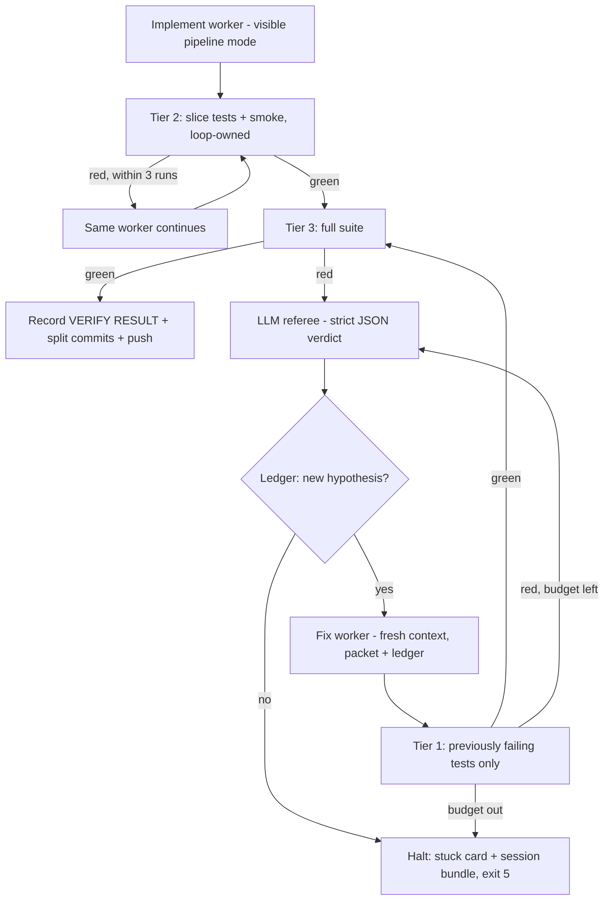

# Factory v2: LLM referee in a Python-enforced harness

> **For the implementing agent:** This is **factory-only** work — Python/shell under `scripts/` plus docs. Do **not** touch app Swift (`PodWash/PodWash/**`) or test targets. Land in mergeable phases: **P0 → P1 → P2**, each with unit tests for the loop code (pattern: `scripts/test_*.py` / `scripts/test-*.sh`) and a `docs/slice-pipeline.md` update. Do not run `scripts/slice-loop.sh` unattended until the P2 confidence gate passes.

## The verdict, honestly

**Is Cursor-multi-agent performance achievable unattended? Yes — the attended Slice 10 session is the existence proof.** The human contribution to that session was starting the chat. Every routing decision, fix, and verification was agent work: Engineer fixed cancel/resume + hit target, QA found one collateral failure, Engineer found the real AX race (not the playbook's "lengthen analyzing window"), QA confirmed 45/45. The mission is possible; the current factory just automates the wrong layer.

**Incremental heuristic fixes only close ~60-70% of the gap.** Better packets, routing heuristics, and visibility fix evidence quality — but they keep the losing architecture: **Python decides, LLM executes**. The attended session won because **an LLM decided, and the harness enforced**. Closing the last gap requires that inversion, not more regexes.

### Why the attended session actually won (deepest first)

1. **In-context judgment**: a frontier model holding the whole session picked the primary failure, chose who to spawn, and rejected the wrong prior ("lengthen window") in favor of the real cause (download refresh clobbering `analysisProgress` AX). `classify_failure()` regexes cannot do this — they labeled 5 mixed failures `ui_race` and discarded a *correct* diagnose (`wrong_state` → `DownloadManager`) because of the heuristic-wins merge policy in [`scripts/failure_packet.py`](../../scripts/failure_packet.py).
2. **Cheap inner loops**: filtered verify after each fix batch; full suite only twice. The factory pays a full rebuild + 45-test suite (~3 min) after *every* fix attempt ([`run_fix_loop`](../../scripts/slice_pipeline.py) `_do_verify` is unfiltered).
3. **Visibility**: role labels, per-step missions, durations — vs `coordinator quiet 22m`.
4. **Fresh context per worker**: each spawn got a narrow mission; nobody doubled down on their own stale theory.

### The realistic bound

One-slice unattended runs ("start it, walk away, return to green or a clean halt") are achievable with this plan. Multi-slice overnight chains compound risk (5 slices at 90% each ≈ 59%) — treat that as a later milestone, gated on single-slice reliability.

---

## Architecture change: LLM referee, Python enforcer

Delete the decision role of `classify_failure` + [`scripts/fix_playbooks.py`](../../scripts/fix_playbooks.py) + diagnose-merge policy. Replace with one **referee** call on every red verify:

- **Input**: FailurePacket (all failing tests, asserts, crash lines, xcresult path), slice file, hypothesis ledger.
- **Output (strict JSON, plan-mode, cheap model)**:

```json
{
  "primary_failure": "PodWashTests/DownloadManagerTests/testCancelRemovesPartialAndRetainsResumeData()",
  "failure_groups": [["unit cancel/resume"], ["download UI"], ["collateral analysis AX"]],
  "role": "Engineer",
  "fix_scope": "app",
  "files": ["PodWash/PodWash/DownloadManager.swift"],
  "instruction": "Resume data nil after cancel: check delegate threading and cancel gate timing",
  "hypothesis": "cancel fires before URLSession flushes bytes; main.sync risks deadlock",
  "confidence": "high"
}
```

- **Python enforces**: budgets, edit-scope, verify ban, ledger check, timeouts, git. Parse failure or low confidence → halt with stuck card (never guess).
- Keep the stuck card and FailurePacket **as evidence formats** — they were the good part of P0. The referee consumes them.

This is exactly what the attended coordinator did, made unattended and bounded. It also kills the whole class of "wrong lever" bugs: there is no lever table to be wrong.

## Tighter cycles: tiered verification

Current: every verify = full `xcodebuild test` (rebuild + sim boot + all 45 tests). Fix:

| Tier | Command shape | Runs | Cost | When |
|------|---------------|------|------|------|
| 0 | `xcodebuild build-for-testing -derivedDataPath build/dd` | build only | ~60s once | start of implement / after code edits |
| 1 | `test-without-building` + `-only-testing:<each previously failing test>` | failed tests only | ~20-40s | **after every fix attempt** |
| 2 | filtered slice-mapped tests + shared-file smoke (e.g. touched `EpisodeListView.swift` → add `AnalysisProgressUITests`) | ~5-8 tests | ~60-90s | implement exit gate |
| 3 | full unfiltered suite | all 45 | ~3 min | once, for Done |

- Add tier support to [`scripts/verify.sh`](../../scripts/verify.sh) (`--tier N` or env), sharing `-derivedDataPath` so tier 3 doesn't rebuild what tier 0 built.
- Fix-loop re-verify order: **tier 1 → (green) → tier 3**. A 2-attempt fix loop drops from ~9 min of verify to ~4.
- Implement gate changes in [`assess_gate_state`](../../scripts/slice_pipeline.py): implement is done when **artifacts exist AND tier 2 green**, not when files exist.
- Simulator hygiene: dedicated pre-booted sim UDID (`simctl bootstatus`), reused across tiers; watchdog that turns a new `.ips` crash file into an immediate structured event + worker prompt injection.

## Eliminating thrash (as far as physics allows)

Thrash cannot be eliminated — wrong hypotheses are inherent. What can be eliminated is **paying for the same wrong hypothesis twice**. Define thrash as *a cycle producing no new information*, then guarantee monotonic information gain:

1. **Hypothesis ledger** — `build/test-results/ledger-slice-NN.jsonl`; every attempt appends `{ts, attempt, role, hypothesis, files_touched, result_signature, verify_tier, outcome}`. Before spawning a fix worker, Python rejects any referee verdict whose hypothesis+signature matches a prior entry → halt with "no new hypothesis" stuck card. Ledger is durable — survives bridge death, so a resumed session never re-explores from zero.
2. **Fresh context on repeat signature** — when the same failure signature comes back, spawn a *new* worker (clean context) with the ledger, instead of advancing a lever. Context pollution (an agent defending its own earlier theory) is a thrash driver the lever mechanism never addressed.
3. **Budgets at every loop level** — `max_implement_verify_runs` (3), `max_fix_attempts` (2/family), wall-clock cap per phase. Distinct exit codes: **5 = thrash** (budget exhausted with evidence), **6 = infra** (bridge/DNS/sim death — retry-safe, attempt not burned if no files changed).
4. **Stress-run policy** — a test that was just fixed and is UITest-flaky gets 5 consecutive runs (what the attended Engineer did manually) before the loop trusts it.

## Revised factory flow



Deltas from today: referee replaces classifier/diagnose/playbooks; tier-1 re-verify replaces full-suite-per-attempt; ledger gates every spawn; coordinator mode is attended-only (unattended = pipeline, every worker visible).

## Visibility (Cursor parity)

1. **JSONL event log** per run: `{ts, slice, phase, role, event, detail}` — spawn, tool, edit path, verify start/end (tier + counts), referee verdict, ledger append, halt.
2. **Terminal timeline** mirroring Cursor's UI: phase banners `IMPLEMENT | TIER2-GATE | FULL-VERIFY | REFEREE | FIX-1/2 | RECORD | COMMIT`, each with role label + one-line mission + elapsed. Kill `coordinator quiet Nm` — always show active role, mission, last tool.
3. **`SUMMARY:` contract** — every worker must end with one machine-parseable summary line; loop prints it as a checkpoint ("Engineer: fixed cancel gate + resume from error userInfo; tier 1 green").
4. **Session bundle on every halt** — `build/test-results/session-slice-NN/`: stuck card, ledger, referee verdicts, VERIFY RESULT lines, xcresult paths, transcript ids. No log archaeology.
5. Later: a small local TUI/HTML dashboard reading the JSONL — the visibility deliverable that transfers to the day-job factory.

### The shift-floor narrator (named agents + personality)

Every spawned worker gets a **name drawn from a role-initial pool**, assigned at spawn and carried through the event log, ledger, and stuck cards so you can follow one agent's arc across the run:

| Role | Initial | Name pool (cycled per run) |
|------|---------|----------------------------|
| Engineer | E | Edison, Elena, Ezra, Esme, Elliott |
| QA | Q | Quinn, Quincy, Queenie, Quill |
| Architect | A | Ada, Atlas, Aurora |
| PM | P | Priya, Parker, Penny |
| UX | U | Uma, Ulysses, Unity |
| Referee | R | Rhea (fixed — one referee per run) |

**Narration points** — one line at every logical beat, written like a shift supervisor walking the floor:

- Spawn: `🔧 Edison (Engineer) clocking in — mission: fix cancel/resume in DownloadManager.`
- Milestone: `Edison has edited 4 files and is running the slice tests now.`
- Worker done: `Edison wrapped: cancel gate + resume-from-error fixed, tier 2 green 5/5. Build heads to QA.`
- Handoff: `🧪 Quinn (QA) takes the build — running the full line, all 45 stations.`
- Verify result: `Quinn's report: 44/45 — one straggler in AnalysisProgress. Back to the floor.`
- Referee verdict: `⚖️ Rhea rules: primary failure is the unit cancel test, app-side. Elena (Engineer) gets the ticket — fresh eyes, Edison's notes attached.`
- Ledger block: `Rhea checked the logbook — Elena's theory matches Edison's failed attempt. Halting before we burn tokens on a rerun.`
- Done: keep the existing ASCII celebration banner, narrated: `🏁 Quinn signs the sheet: 45/45. Slice 10 ships. Edison, Elena — good shift.`

### Murphy, the factory monkey (failure mascot)

The factory has one resident villain: **Murphy** 🐒, an evil monkey the whole floor blames when things go red (homage to Netflix's Chaos Monkey + Murphy's law). Every failed-test narration line carries the monkey emoji and a blame beat:

- Red verify: `🐒 Quinn's report: 43/45 — Murphy's been at the download station again.`
- Simulator crash: `🐒 Something knocked the simulator over. Murphy denies everything. Rhea is pulling the crash log.`
- Flake suspicion (Murphy's true domain): `🐒 Rhea suspects Murphy — flake signals. Running the line once more before blaming the code.`
- Cold retry passes: `Murphy confirmed. It ran green untouched. Logging the flake and moving on.`
- Root cause found — **the exoneration beat** (mandatory): `Turns out it wasn't Murphy — the cancel gate fires before bytes flush. Edison owns it.`
- Thrash halt: `🐒 Murphy wins this round. Halting — logbook and stuck card are on the desk. (exit=5)`
- Green Done: `Not a monkey in sight. 45/45.`

**Guardrails (why this isn't a terrible idea, kept honest):**

1. **Narration layer only.** Murphy never appears in structured fields, ledger entries, stuck cards, or the JSONL event log — those state the literal failure. The monkey is a rendering, like the names.
2. **Exoneration is mandatory.** Any failure the referee attributes to a real cause gets the "wasn't Murphy" beat naming the actual bug and owner. Blame-the-monkey is a placeholder for *undiagnosed*, never a resting state — the factory culture stays "bugs are ours."
3. **Flake is the one place Murphy is canon.** When the cold-retry policy confirms a flake (green with no code change), the narration credits Murphy — which is truthful: nondeterminism really is an outside agent.
4. Template-driven like the rest of the narrator: the 🐒 emoji triggers off `verify_end.failed > 0` and crash events; blame/exoneration lines are Python templates keyed off referee verdict fields. Zero extra LLM cost.

**Implementation (two layers, cheap by design):**

1. **Template narration (free, instant, deterministic)** — Python renders the lines above from JSONL events (spawn, edit-count from tool stream, verify_end, verdict, halt). No LLM tokens; names come from the pool assigner. This covers ~90% of beats and never lies.
2. **Referee-written handoff color (small LLM cost, already in-flight)** — the referee's JSON verdict gains one field: `"narration": "<=25 words, shift-supervisor voice"`. Since the referee is already reading the evidence at every red, the richer "what's really going on" line costs one extra field, not an extra call. Same for worker `SUMMARY:` lines — the narrator quotes them: `Edison's note: "resume data needs ETag; stub lacked validators."`

**Rules so fun never obscures truth:** every narrated line carries the plain structured fields after it (`role=Engineer tier=2 exit=0 failed=0`); names map 1:1 to transcript/agent ids in the session bundle; narration is a rendering of events, never a substitute — the JSONL stays the source of truth.

## What stays vs goes

**Keep**: `verify.sh` as Done truth (extended with tiers), `next-slice.sh`, FailurePacket + stuck card as *evidence formats*, fix budgets + verify-ban on fix workers, pipeline FSM, role agents + model pins, PRD/slices/ADRs/test isolation.

**Replace**: `classify_failure`/`fix_playbooks` as router → LLM referee; heuristic-wins diagnose merge → referee is the diagnosis; implement gate = files-on-disk → tier-2 green; full-suite-per-fix-attempt → tier 1 first; coordinator mode for unattended → pipeline only; lever advance on repeat → fresh-context + ledger.

## Workplan

- **P0** (before any unattended run): verify tiers in `verify.sh` + `run_fix_loop` re-verify order; LLM referee (prompt, JSON schema, parse, halt-on-low-confidence); hypothesis ledger + spawn gate + fresh-context retry.
- **P1**: JSONL event log + timeline + SUMMARY contract; **shift-floor narrator** (name pools, template narration from events, referee `narration` field); pipeline-only unattended with implement tier-2 gate and `max_implement_verify_runs`; exit 6 infra vs 5 thrash with attempt-preservation; sim pre-boot + crash watchdog + stress-run policy.
- **P2 confidence gate**: replay a Slice-10-shaped multi-failure red (or synthetic: one unit assertion + one UITest wait + one collateral) and require: referee picks the unit failure as primary, ledger blocks a repeat hypothesis, tier-1 re-verify used, timeline readable end-to-end. **No new unattended slice until this passes.**

## Technical appendix

**Referee prompt skeleton** (plan mode, cheap model, temperature low):

```text
You are the fix referee. Evidence: [stuck card + FailurePacket JSON + ledger entries].
Slice: [slice file path + deliverables list].
Return ONLY JSON: {primary_failure, failure_groups, role: Engineer|QA,
fix_scope: app|tests, files[], instruction (<=2 sentences), hypothesis, confidence: high|med|low,
narration (<=25 words, shift-supervisor voice)}.
Rules: prefer unit assertion/crash over UITest waits as primary; never propose
weakening tests; if evidence is insufficient say confidence: low.
```

**Ledger entry**:

```json
{"ts":"2026-07-10T16:44:00Z","slice":10,"attempt":1,"role":"Engineer","agent_name":"Edison",
 "hypothesis":"cancel fires before bytes flushed; resume nil",
 "files_touched":["PodWash/PodWash/DownloadManager.swift"],
 "result_signature":"DownloadManagerTests/testCancel...+DownloadUITests/testDownload...",
 "verify_tier":1,"outcome":"red"}
```

**Event log entry**:

```json
{"ts":"...","slice":10,"phase":"fix-1","role":"Engineer","agent_name":"Edison","event":"verify_end",
 "detail":{"tier":1,"exit":0,"failed":0,"bundle":"build/test-results/verify-....xcresult"}}
```

**verify.sh tier interface**: `VERIFY_TIER=1 VERIFY_FAILED_TESTS="A/b() C/d()" scripts/verify.sh` maps failed test ids to `-only-testing:` args and uses `test-without-building` when `build/dd` xctestrun is fresh; tier 3 remains the unfiltered Done gate with the existing `VERIFY RESULT:` line unchanged.
