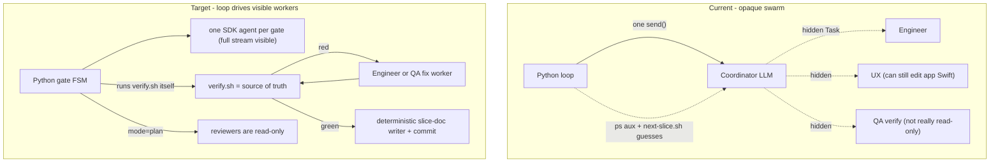

# Loop-as-Orchestrator Refactor (Option B)

## The fatal flaw we are removing
Today `run_slice` in [scripts/slice_loop.py](scripts/slice_loop.py) launches ONE SDK agent (the coordinator LLM). That coordinator spawns PM/UX/QA/Architect/Engineer through the IDE Task tool **inside its own turn**, so those subagents are invisible to and uncontrollable by our Python. Every guard we have (`red verify N/2`, ps-sniff in `sniff_background_build`, `next-slice.sh` post-hoc re-check, the advisory WRONG ROLE warning) is a workaround for that opaque boundary. Result: roles are personas not capabilities, the least-reliable component (an LLM) owns deterministic control flow, and verification is trusted until too late.



## Design: what moves into code vs stays LLM
- **Into Python (deterministic):** gate ordering, skip-done-gates, running `verify.sh`, red→Engineer|QA routing with a shared bounded retry, writing `VERIFY RESULT` + Status Done + plan-review lines, split commits + push, isolation check, halt-and-ask detection, model/mode selection per role.
- **Stays LLM (judgment only):** writing the story, UX spec, tests, app code; diagnosing a failing test; reviewing an ADR/test spec. Each is one tightly-scoped SDK worker call.
- **Does not stay LLM:** “QA verify” as a role that runs `verify.sh`. The loop owns verify; on red it routes to a fix worker. Reviewers use `mode=plan`; they do not run the suite.

## Reuse (do not reinvent)
- [scripts/next-slice.sh](scripts/next-slice.sh) stays the dependency/halt/done brain (already emits `start|wait|halt|done` JSON).
- [scripts/verify.sh](scripts/verify.sh) stays the only truth; the loop calls it directly.
- `scripts/check-test-isolation.sh` stays the in-band anti-cheat; the loop runs it before commits.
- `parse_verify_result` / failure + crash helpers in [scripts/slice_loop_progress.py](scripts/slice_loop_progress.py) — extend the regex to capture `bundle=` for fix-worker prompts.
- `RunProgress` is reused for per-worker rendering (Phase 3).
- `.cursor/agents/*.md` personas feed `run_worker()` prompts; **model ids are pinned in code** as plain SDK ids (`composer-2.5`, `grok-4.5`) — do not scrape frontmatter bracket syntax.
- `assess_slice_gates()` is a **heuristic progress checklist only**. It is **not** the FSM. Phase 2.1 replaces it with a real `GateState` + artifact contracts; the old function may remain for display until cutover.

## Phase reshape (landable increments)

```text
1a  Loop owns verify.sh + parse + exit 5 (no new SDK workers yet)
1b  Visible fix worker(s) with Engineer|QA router + shared budget
1c  Prompt/handoff: coordinator must not verify or fix-grind
2.0 Spike mode=plan + multi create_agent on one bridge
2.1 GateState + artifact contracts (no LLM yet)
2.2 run_worker + FSM + --orchestrator=pipeline
3   Loop commits/push + doc updater; delete coordinator path + sniff/heuristics
```

---

## Phase 1a — Loop owns verify (smallest landable win)
Cure “trusted until too late” without new SDK workers.

- After the coordinator run returns (or when status is already `In Progress` / `Verify`), the **loop** runs `scripts/verify.sh` as a subprocess and parses `VERIFY RESULT:` as truth (extend parser to keep `bundle=`).
- On green: proceed toward Done recording (Phase 3 owns the full doc writer; 1a may still rely on coordinator for Status/VERIFY RESULT lines, or land a minimal writer early if cheap).
- On red: hard `HALT` (exit 5) after `--max-fix-attempts` observations once 1b exists; in pure 1a, halt immediately after loop-owned red (or after N loop-owned reds) so the coordinator cannot grind.
- **Never** run loop verify in parallel with a coordinator-owned verify (`verify.sh` has a lock; contention is a real failure mode).

## Phase 1b — Visible fix workers + Engineer|QA router
Red → Engineer-only is too narrow (bad assertions/fixtures need QA).

| Signal | Worker | Edit scope |
|--------|--------|------------|
| Failures under `PodWash/PodWash/**`, simulator crash, new IPS | Engineer | `PodWash/PodWash/**` only |
| Failures under `*Tests*`, fixture, XCTAssert on expected API | QA (agent mode) | test/fixture paths only |
| Ambiguous | Engineer first; if same failure signature persists, one QA attempt | as above |

- Loop invokes the chosen worker as its own SDK run (`create_agent` + `send`) with a tight prompt: failing test name(s) + `bundle=` xcresult path + edit-scope rule. Full stream visible.
- Shared budget: `--max-fix-attempts` (default 2), not Engineer-only. Exhaustion → exit 5 with failing test + what-happened/next.
- **Persist the budget across bridge retries** (today a fresh `RunProgress` on reconnect resets thrash counters — do not repeat that bug for the loop-owned budget).

## Phase 1c — Explicit handoff contract (P0)
“After the coordinator reports implement done” is not an API. Define one:

1. **Prompt change:** coordinator **must not** run `scripts/verify.sh` / `xcodebuild … test`, and **must not** grind fixes. It stops when implement artifacts exist (or status is Verify) and returns.
2. **Loop always owns verify** when implement gate is done on disk **or** status ∈ `{In Progress, Verify}`.
3. **Sequential only:** end coordinator run → loop verify → (optional) fix worker → verify… Never parallel verify.
4. Legacy thrash heuristics (`infer_role` surgery, WRONG ROLE → `ThrashHalt`, `run.cancel()` watchdog) are **optional and deferred**. Do not polish the opaque box; Phase 1’s cure is loop-owned verify + visible fix workers. Thin wrong-role halt only if Phase 2 slips and Slice 09 still thrash-spawns UX.

## Phase 2.0 — SDK spike (before FSM coding)
Validate before relying on enforcement:

- `mode="plan"` (`AgentModeOption` in installed `cursor_sdk`) for a reviewer-shaped prompt: can it read files / refuse writes?
- Multiple `create_agent` calls on one `launch_bridge` session; dispose each agent cleanly.
- Plain model ids work for Architect/Engineer (`grok-4.5`) and PM/UX/QA (`composer-2.5`).
- Fallback if `plan` is too restrictive: prompt + isolation hook only for that gate; do not block the whole refactor.

## Phase 2.1 — `GateState` + artifact contracts
Do **not** promote `assess_slice_gates()` into an FSM. Build:

- Strict per-gate artifact contracts (required paths + required slice-file lines).
- Separate `adr_review_qa` and `adr_review_pm` with **fork/join** (workflow requires both; today’s checklist flattens to one `adr_review`).
- Blocker parsing from Plan review record text (not just “cleared”).
- Commit gate = git evidence + Status Done + green VERIFY RESULT (not Status alone).
- Conditional / waivable Architect + UX gates from slice Role artifacts metadata.
- Unit tests for transitions with synthetic slice files (no SDK).

## Phase 2.2 — Pipeline FSM + `run_worker`
- New module `scripts/slice_pipeline.py`: state machine over  
  `story → [architect|ux] → adr_review_{qa,pm} → test_spec → test_spec_review → implement → verify → record → commit`,  
  skipping gates already satisfied by `GateState`.
- `run_worker(role, task, artifacts)`: one SDK agent per gate.
  - role → model map pinned in code; never Fast variants.
  - `mode="plan"` for **reviewers only** (ADR QA/PM, test-spec Architect). Engineer + QA-author use `agent` mode.
  - **No LLM “QA verifier” gate** — loop runs `verify.sh`; green → deterministic record step.
  - prompt = persona from `.cursor/agents/<role>.md` + one gate’s task + only needed artifacts.
- `--orchestrator=coordinator|pipeline` for dual-path cutover. **Time-box:** one Slice 09-style smoke + N green pipeline runs, then delete the coordinator path in the same Phase 3 PR. Do not keep two orchestration brains long-term.
- Partial-failure policy (write it down in `docs/slice-pipeline.md`): reuse one bridge; dispose agents per gate; if gate N fails after earlier gates produced artifacts, leave artifacts on disk, halt with gate id + attempt, do not auto-revert.

## Phase 3 — Finish, observability, cleanup
- **Deterministic slice-doc writer (P0 for closing the loop):** after green verify, Python writes `VERIFY RESULT:` into the slice verification record and sets Status → Done. Reviewer workers return structured outcomes; the loop writes Plan review record lines. `next-slice.sh` Done requires these — do not leave them to an LLM.
- Loop owns split commits (`slice-NN: test spec` then `slice-NN: implement`), runs `check-test-isolation.sh --staged`, then push — all deterministic.
- **Resolve push policy in docs** in the same change: pick auto-push-on-Done for the unattended loop (matches coordinator rule today) and align `dark-factory.md` / `multitask-workflow.md` (they currently disagree).
- Per-worker `RunProgress` + gate ledger, e.g. `> [gate:implement][Engineer] editing EpisodeListView.swift · attempt 2/2 · 2m`.
- Delete `sniff_background_build` / ps-sniff, WRONG ROLE guessing, and the opaque-box heuristics once pipeline is default. Workers are visible; the loop picks the role.

## Optional planner (not a vague escape hatch)
- Flag or slice metadata (`--plan` / `planner: true`) runs one LLM pre-step for non-standard slices.
- Default path is pure FSM. Halt-and-ask (PRD §11) still comes from `next-slice.sh` + slice metadata and stops the run — no silent product defaults.

## Risks and mitigations
- **Lost coordinator adaptivity:** optional planner (explicit trigger only); FSM for the standard path.
- **Blast radius:** phased landings; time-boxed `--orchestrator` dual path; each phase ships with tests.
- **More SDK calls per slice (~9):** reuse one `launch_bridge`; `create_agent` per gate; dispose agents; measure tokens on one slice before claiming net savings (scoped prompts help; round-trips can erase gains).
- **`mode=plan` / multi-agent:** Phase 2.0 spike before enforcement; fallback to prompt + isolation if needed.
- **Handoff / lock contention:** Phase 1c contract + sequential verify only.
- **Bridge retry resetting budgets:** persist loop-owned fix budget outside per-attempt `RunProgress`.
- **Model id mismatch:** pin plain ids in code; never scrape `grok-4.5[effort=…]` frontmatter for SDK.

## Verification
- `python3 -m unittest scripts.test_slice_loop_progress scripts.test_slice_loop_bridge` plus new `scripts.test_slice_pipeline` (GateState, router, verify-owned retry/halt, model/mode map) all green.
- `scripts/slice-loop.sh --dry-run` and `--orchestrator=pipeline --dry-run` work with no SDK/key.
- Manual smoke on Slice 09: loop runs verify itself, routes red `testProgressIndicatorLifecycle` to a visible Engineer (or QA if test-side) worker, and halts cleanly after 2 shared attempts instead of thrashing.

## Out of scope
- No changes to Slice 09 app Swift/tests here (its UI test still needs a real Engineer fix — now via the visible worker path).
- No coordinator model swap; the win is moving orchestration into code + SDK-level read-only for reviewers, not reprompting personas.
- Deep per-tool sandboxing beyond `mode=plan` + the isolation hook is deferred (later Option C).
- Polishing legacy `infer_role` / cancel-watchdog on the dying coordinator path — only if Phase 2 slips.
