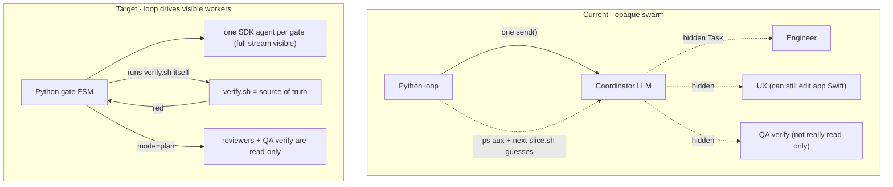

# Loop-as-Orchestrator Refactor (Option B)

## The fatal flaw we are removing
Today `run_slice` in [scripts/slice_loop.py](scripts/slice_loop.py) launches ONE SDK agent (the coordinator LLM). That coordinator spawns PM/UX/QA/Architect/Engineer through the IDE Task tool **inside its own turn**, so those subagents are invisible to and uncontrollable by our Python. Every guard we have (`red verify N/2`, ps-sniff in `sniff_background_build`, `next-slice.sh` post-hoc re-check, the advisory WRONG ROLE warning) is a workaround for that opaque boundary. Result: roles are personas not capabilities, the least-reliable component (an LLM) owns deterministic control flow, and verification is trusted until too late.

## Design: what moves into code vs stays LLM
- **Into Python (deterministic):** gate ordering, skip-done-gates, running `verify.sh`, red->Engineer routing with a bounded retry, split commits + push, isolation check, halt-and-ask detection, model/mode selection per role.
- **Stays LLM (judgment only):** writing the story, UX spec, tests, app code; diagnosing a failing test; reviewing an ADR/test spec. Each is one tightly-scoped SDK worker call.

## Reuse (do not reinvent)
- [scripts/next-slice.sh](scripts/next-slice.sh) stays the dependency/halt/done brain (already emits `start|wait|halt|done` JSON).
- `assess_slice_gates()` in [scripts/slice_loop_progress.py](scripts/slice_loop_progress.py) already derives which gates are done from the slice file + disk -> this becomes the FSM's state function and kills the RESUME-prompt hack.
- [scripts/verify.sh](scripts/verify.sh) stays the only truth; the loop calls it directly.
- `scripts/check-test-isolation.sh` stays the in-band anti-cheat; the loop runs it before commits.
- `RunProgress` is reused for per-worker rendering.

## Phase 1 - Cure the thrash first (loop owns verify + bounded Engineer retry)
Highest ROI, lands without the full FSM. Keep the legacy coordinator for authoring gates, but take verification and the fix-loop away from it.
- After the coordinator reports implement done (or when status is In Progress/Verify), the **loop** runs `scripts/verify.sh` (subprocess) and parses `VERIFY RESULT:` as truth.
- On red: the loop invokes a dedicated **Engineer worker** as its own SDK run (`create_agent` + `send`) with a tight prompt = failing test name(s) + newest `build/test-results/verify-*.xcresult` + "edit only PodWash/PodWash/**". This run's full stream is visible.
- Loop reruns verify; repeat up to `--max-engineer-attempts` (default 2); then hard `HALT` (exit 5) with the failing test + what-happened/next. This is the retry budget, now structural and subagent-visible.
- Belt-and-suspenders for the still-present coordinator path: land the earlier guards - `infer_role` fix-intent fix (so "Fix ... UI test" -> Engineer not UX, [slice_loop_progress.py](scripts/slice_loop_progress.py) ~L244-258), immediate `ThrashHalt` on wrong-role fix spawns in `_handle_task_tool`, and the `run.cancel()` watchdog for silent long subagents (`run.cancel()` confirmed at [_run.py](build/.slice-loop-venv/lib/python3.13/site-packages/cursor_sdk/_run.py) L120).

## Phase 2 - Gate FSM replaces the coordinator
- New module `scripts/slice_pipeline.py`: a state machine over the gate graph `story -> design/ux -> adr_review -> test_spec -> test_spec_review -> implement -> verify -> commit`, with conditional (waivable) Architect/UX gates read from slice metadata.
- Current state comes from `assess_slice_gates()`; the FSM skips gates already satisfied on disk (no LLM re-derivation, no RESUME block).
- `run_worker(role, task, artifacts)` invokes exactly one SDK agent per gate:
  - role -> model map (PM/UX/QA = `composer-2.5`; Architect/Engineer = `grok-4.5`), never the Fast variants.
  - `mode="plan"` (read-only, per `AgentModeOption` in the SDK) for ADR reviewers, test-spec reviewer, and the QA verifier -> reviewers/verifier now *physically cannot* edit. Engineer/QA-author run in `agent` mode.
  - prompt = the persona from `.cursor/agents/<role>.md` + the one gate's task + only needed artifacts.
- Add `--orchestrator=coordinator|pipeline` so we can run the FSM alongside the legacy path until proven, then flip the default.

## Phase 3 - Enforcement, commits, cleanup
- Loop owns the finish: split commits (`slice-NN: test spec` then `slice-NN: implement`), run `check-test-isolation.sh --staged`, then push - all deterministic, no LLM.
- Delete `sniff_background_build` / ps-sniff and the opaque-box heuristics once pipeline is default (workers are visible now).
- Per-worker `RunProgress` + a gate ledger line, e.g. `> [gate:implement][Engineer] editing EpisodeListView.swift · attempt 2/2 · 2m`. No mislabels, no `WRONG ROLE` guessing - the loop picks the role.

## Risks and mitigations
- **Lost coordinator adaptivity** (weird slices, product judgment): keep an optional LLM "planner" pre-step for non-standard slices; FSM handles the standard path. Halt-and-ask (PRD §11) still detected via `next-slice.sh` + slice metadata and stops the run.
- **Blast radius**: strictly phased; `--orchestrator` flag keeps the old path runnable until the FSM is trusted; each phase ships with tests.
- **More SDK calls per slice**: reuse a single `launch_bridge` and call `create_agent` per gate; net tokens likely drop (no re-reading rules/workflow each turn, no subagent re-exploration).
- **SDK behavior of `mode=plan`/multi-agent**: validate with a spike in Phase 2 before relying on it for enforcement; fall back to `check-test-isolation.sh` + prompt if `plan` mode proves too restrictive for a needed read tool.

## Verification
- `python3 -m unittest scripts.test_slice_loop_progress scripts.test_slice_loop_bridge` plus new `scripts.test_slice_pipeline` all green.
- `scripts/slice-loop.sh --dry-run` and `--orchestrator=pipeline --dry-run` work with no SDK/key.
- Manual smoke on Slice 09: pipeline runs verify itself, routes the red `testProgressIndicatorLifecycle` to a visible Engineer worker, and halts cleanly after 2 attempts instead of thrashing.

## Out of scope
- No changes to Slice 09 app Swift/tests here (its UI test still needs a real Engineer fix - now via the visible worker path).
- No coordinator model swap; the win is moving orchestration into code + SDK-level read-only enforcement, not reprompting personas.
- Deep per-tool sandboxing beyond `mode=plan` + the isolation hook is deferred (would be a later Option C step).
