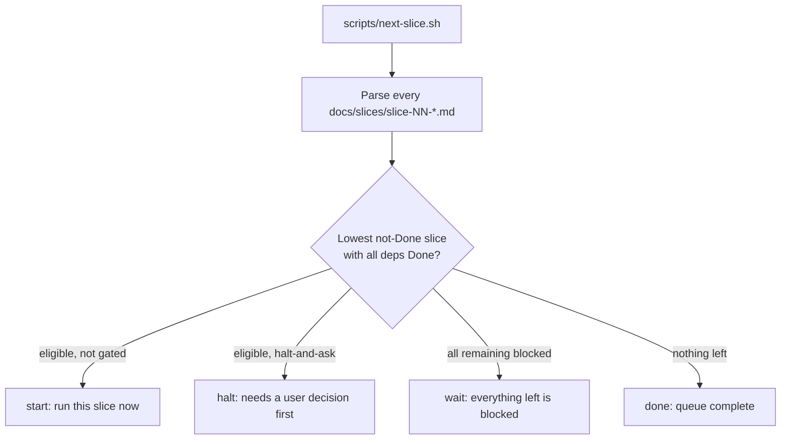

# Slice runner — `scripts/next-slice.sh`

> The dependency-aware "what do I run next?" brain for the PodWash slice factory.
> It reads the slice stories under [`docs/slices/`](slices/README.md), respects
> each slice's `## Depends on` graph and halt-and-ask gates, and tells you the
> single next slice to run — plus a copy-paste coordinator prompt.
>
> **Read-only.** The script never edits slice files or commits anything.
> **Sequential.** It picks one slice at a time (lowest eligible number).

## Why this exists

Process, roles, and gates live in [`multitask-workflow.md`](multitask-workflow.md):
one coordinator session per slice, `scripts/verify.sh` full-suite green is Done.
The open question that doc left as a "future upgrade" was chaining sessions so the
next slice starts when the previous one lands. `next-slice.sh` is the first,
robust piece of that: it removes the "which slice is next, and is it even
unblocked?" guesswork. Auto-triggering is a deferred phase (see below).

## What it does



### Done finish-signal (conservative)

A slice counts as **Done** only when **both** are true, so a half-finished slice
never advances the queue:

1. Its file has `| **Status** | Done |`.
2. Its verification record has a line like
   `VERIFY RESULT: exit=0 ... failed=0 ... skipped=0`.

A slice whose status says `Done` but has no green `VERIFY RESULT` is treated as
**not done** — the runner surfaces it again so it gets finished properly.

### Eligibility and pick policy

- **Eligible** = not Done, and every dependency listed under `## Depends on` is Done.
- Among eligible slices, the runner picks the **lowest slice number** (sequential).
- Dependencies are read from bullet lines under `## Depends on` (e.g. `Slice 01`,
  `Slices 02, 05`, `None`). The `**Parallelizable:**` note directly under that
  heading is intentionally ignored — its slice numbers are not dependencies.

### Halt-and-ask gates

Some slices require a product decision before any agent starts (PRD §11). These
are hardcoded in the script (`HALT_SLICES`), derived from
[`docs/slices/README.md`](slices/README.md):

| Slice | Decision |
|-------|----------|
| 11 | SwiftData vs Core Data (persistence) |
| 13 | default word/category profile, default action, analysis timing |
| 15 | CarPlay at MVP vs fast-follow |
| 17 | monetization model |

The list is hardcoded (rather than scanning for the phrase "halt-and-ask")
because some slices mention halt-and-ask for a narrow sub-case only — e.g.
slice 05 mentions it just for lowering the iOS floor, and should not be gated.
If future slices add gates, edit `HALT_SLICES` at the top of the script.

## Usage

```bash
scripts/next-slice.sh            # human summary + copy-paste coordinator prompt
scripts/next-slice.sh --json     # one machine-readable JSON object
scripts/next-slice.sh --status   # table of every slice: ID, Status, DepsMet, BlockedBy
scripts/next-slice.sh --help
```

### Typical flow

1. Run `scripts/next-slice.sh`.
2. If it prints `Next slice: NN ...`, open a **new** coordinator chat and paste
   the printed prompt.
3. Let the coordinator run the slice to Done (full `scripts/verify.sh` green +
   verification record + auto-commit), per
   [`.cursor/rules/podwash-coordinator.mdc`](../.cursor/rules/podwash-coordinator.mdc).
4. Run `scripts/next-slice.sh` again for the next one.

### `--status` example

```
ID    Status       DepsMet   BlockedBy
--    ------       -------   ---------
01    Done         done      -
05    Draft        yes       -
07    Draft        no        5
11    Draft        no        6
```

`DepsMet`: `done` (slice complete), `yes` (ready to start), `no` (blocked).
`BlockedBy` lists the dependency slice IDs that are not yet Done.

## JSON contract

Exactly one JSON object on stdout. Consumers should branch on `action`.

**start** — run this slice:
```json
{"action":"start","id":5,"file":"docs/slices/slice-05-asr-spike.md","prompt":"Run Slice 05 per ..."}
```

**halt** — eligible but needs a user decision first:
```json
{"action":"halt","id":11,"file":"docs/slices/slice-11-queue-resume.md","reason":"Slice 11 (Queue + resume) is a halt-and-ask gate — the user must make a product decision before this slice starts."}
```

**wait** — every remaining slice is blocked on an unfinished dependency:
```json
{"action":"wait","id":7,"blocked_by":[5,2],"message":"Slice 07 waiting on slice(s) 5 2"}
```

**done** — nothing left:
```json
{"action":"done","message":"No eligible slices remaining"}
```

Exit code is `0` for any action; `1` only on a usage or parse error.

## Tests

[`scripts/test-next-slice.sh`](../scripts/test-next-slice.sh) covers start,
sequencing, wait/blocked-by, halt, done, the Done-without-green guard, and a
smoke test against the real `docs/slices/`. It uses synthetic fixture slice
files via the `PODWASH_SLICES_DIR` environment override, so it needs no Xcode or
simulator and can run in CI.

```bash
scripts/test-next-slice.sh
```

## Phase 2 (deferred, not built)

Once the script is trusted, either of these can call `--json` to close the loop —
both reuse the script unchanged, so there is no rework:

- **Cursor Automation (cheapest).** A **local**-runtime automation triggered on
  git push of `slice-NN:` commits runs `scripts/next-slice.sh --json` and acts on
  `action`: on `start`, become the coordinator for `file`; on `wait`/`done`, do
  nothing; on `halt`, stop and notify the user. Local runtime is required because
  `scripts/verify.sh` needs Xcode + the iOS Simulator, which cloud agents lack.
  Note the trigger is on **push**, so a slice's auto-commit must be pushed for the
  next one to fire.
- **Cursor SDK loop.** A local script (`Agent.prompt(...)`) that reads `--json`,
  starts the slice, waits for the Done signal (status + green `VERIFY RESULT`),
  then repeats. Choose this if you later want parallel fan-out of independent
  slices (e.g. 05 and 06) or Slack notifications on halt.

Neither is implemented yet. The script alone already removes the error-prone part
(picking a valid next slice); wiring a trigger is an independent, low-risk add.
