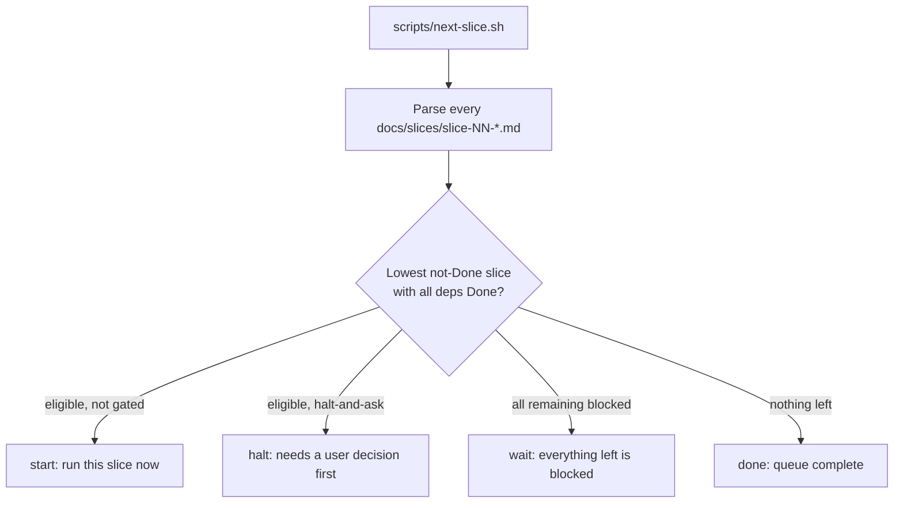
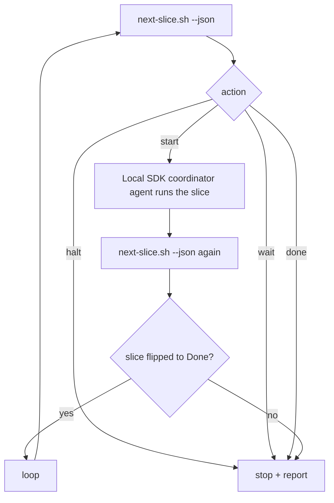

# Slice runner — `scripts/next-slice.sh`

> **Onboarding (fresh agent):** [`dark-factory.md`](dark-factory.md) — start here for
> how the factory, coordinator sessions, and scripts fit together. This page is the
> technical reference for the runner scripts.
> It reads the slice stories under [`docs/slices/`](slices/README.md), respects
> each slice's `## Depends on` graph and halt-and-ask gates, and tells you the
> single next slice to run — plus a copy-paste coordinator prompt.
>
> **Read-only.** The script never edits slice files or commits anything.
> **Sequential.** It picks one slice at a time (lowest eligible number).

## Why this exists

Process, roles, and gates live in [`multitask-workflow.md`](multitask-workflow.md):
one coordinator session per slice, `scripts/verify.sh` full-suite green is Done.
The open question that doc left as a "future upgrade" was chaining sessions so the
next slice starts when the previous one lands. `next-slice.sh` is the first,
robust piece of that: it removes the "which slice is next, and is it even
unblocked?" guesswork. Auto-triggering is a deferred phase (see below).

## What it does



### Done finish-signal (conservative)

A slice counts as **Done** only when **both** are true, so a half-finished slice
never advances the queue:

1. Its file has `| **Status** | Done |`.
2. Its verification record has a line like
   `VERIFY RESULT: exit=0 ... failed=0 ... skipped=0`.

A slice whose status says `Done` but has no green `VERIFY RESULT` is treated as
**not done** — the runner surfaces it again so it gets finished properly.

### Eligibility and pick policy

- **Eligible** = not Done, and every dependency listed under `## Depends on` is Done.
- Among eligible slices, the runner picks the **lowest slice number** (sequential).
- Dependencies are read from bullet lines under `## Depends on` (e.g. `Slice 01`,
  `Slices 02, 05`, `None`). The `**Parallelizable:**` note directly under that
  heading is intentionally ignored — its slice numbers are not dependencies.

### Halt-and-ask gates

Some slices require a product decision before any agent starts (PRD §11). These
are hardcoded in the script (`HALT_SLICES`), derived from
[`docs/slices/README.md`](slices/README.md):

| Slice | Decision |
|-------|----------|
| 11 | SwiftData vs Core Data (persistence) |
| 13 | default word/category profile, default action, analysis timing |
| 15 | CarPlay at MVP vs fast-follow |
| 17 | monetization model |

The list is hardcoded (rather than scanning for the phrase "halt-and-ask")
because some slices mention halt-and-ask for a narrow sub-case only — e.g.
slice 05 mentions it just for lowering the iOS floor, and should not be gated.
If future slices add gates, edit `HALT_SLICES` at the top of the script.

## Usage

```bash
scripts/next-slice.sh            # human summary + copy-paste coordinator prompt
scripts/next-slice.sh --json     # one machine-readable JSON object
scripts/next-slice.sh --status   # table of every slice: ID, Status, DepsMet, BlockedBy
scripts/next-slice.sh --help
```

### Typical flow

1. Run `scripts/next-slice.sh`.
2. If it prints `Next slice: NN ...`, open a **new** coordinator chat and paste
   the printed prompt.
3. Let the coordinator run the slice to Done (full `scripts/verify.sh` green +
   verification record + auto-commit), per
   [`.cursor/rules/podwash-coordinator.mdc`](../.cursor/rules/podwash-coordinator.mdc).
4. Run `scripts/next-slice.sh` again for the next one.

### `--status` example

```
ID    Status       DepsMet   BlockedBy
--    ------       -------   ---------
01    Done         done      -
05    Draft        yes       -
07    Draft        no        5
11    Draft        no        6
```

`DepsMet`: `done` (slice complete), `yes` (ready to start), `no` (blocked).
`BlockedBy` lists the dependency slice IDs that are not yet Done.

## JSON contract

Exactly one JSON object on stdout. Consumers should branch on `action`.

**start** — run this slice:
```json
{"action":"start","id":5,"file":"docs/slices/slice-05-asr-spike.md","prompt":"Run Slice 05 per ..."}
```

**halt** — eligible but needs a user decision first:
```json
{"action":"halt","id":11,"file":"docs/slices/slice-11-queue-resume.md","reason":"Slice 11 (Queue + resume) is a halt-and-ask gate — the user must make a product decision before this slice starts."}
```

**wait** — every remaining slice is blocked on an unfinished dependency:
```json
{"action":"wait","id":7,"blocked_by":[5,2],"message":"Slice 07 waiting on slice(s) 5 2"}
```

**done** — nothing left:
```json
{"action":"done","message":"No eligible slices remaining"}
```

Exit code is `0` for any action; `1` only on a usage or parse error.

## Tests

[`scripts/test-next-slice.sh`](../scripts/test-next-slice.sh) covers start,
sequencing, wait/blocked-by, halt, done, the Done-without-green guard, and a
smoke test against the real `docs/slices/`. It uses synthetic fixture slice
files via the `PODWASH_SLICES_DIR` environment override, so it needs no Xcode or
simulator and can run in CI.

```bash
scripts/test-next-slice.sh
```

## Phase 2 — the auto-run loop (built)

[`scripts/slice-loop.sh`](../scripts/slice-loop.sh) (driver:
[`scripts/slice_loop.py`](../scripts/slice_loop.py)) closes the loop: it runs
eligible slices to Done, one after another, unattended, on your Mac.

### Why local (and not a Cursor Automation)

The Done gate is `scripts/verify.sh`, which needs **Xcode + the iOS Simulator**.
Those exist only on your machine, not on Cursor's cloud infrastructure — and
Cursor Automations run as cloud agents. So a cloud automation could *detect* that
the next slice is eligible but could never *verify* an iOS slice. The loop
therefore runs a **local** Cursor SDK agent (`local.cwd = repo root`), where
`verify.sh` works for real.

### How it works



**Verification honesty:** the loop advances only when `next-slice.sh` re-confirms
the slice is no longer the `start` target — i.e. its status flipped to Done with a
green `VERIFY RESULT`. It never trusts the agent's self-report, and a no-progress
guard stops it from re-running the same slice twice. Halt-and-ask and verify
failures stop the loop with a clear message rather than guessing.

### Prerequisites

- **Python 3.10+** for `cursor-sdk`. On macOS, `/usr/bin/python3` is often **3.9**
  (from Xcode) and cannot install the SDK. `slice-loop.sh` auto-selects
  `python3.13` / `python3.12` / … if present (e.g. `brew install python@3.12`).
  Override: `PODWASH_PYTHON=python3.12 scripts/slice-loop.sh`
- **`CURSOR_API_KEY`** — create at [Cursor Dashboard → Integrations](https://cursor.com/dashboard/integrations)
  (user API key or team service-account key; starts with `cursor_...`).

### Usage

```bash
export CURSOR_API_KEY=cursor_...        # user or team service-account key

scripts/slice-loop.sh                    # run the queue until it stops
scripts/slice-loop.sh --dry-run          # show the next decision; spawns no agent, no key needed
scripts/slice-loop.sh --max 3            # cap slices run this session (default 6)
scripts/slice-loop.sh --model auto       # let the server pick the coordinator model
```

The wrapper creates an isolated venv under `build/` (gitignored) and installs
[`scripts/slice-loop-requirements.txt`](../scripts/slice-loop-requirements.txt)
(`cursor-sdk`). The coordinator agent runs on `composer-2.5[fast=false]` and spawns role
subagents by name per the workflow's model assignment (`.cursor/agents/`; never
`composer-2.5-fast` or `grok-4.5-fast-xhigh`).

### Exit codes

| Code | Meaning |
|------|---------|
| 0 | Queue complete, or `--max` reached cleanly |
| 1 | Agent never started (auth/config/network) |
| 2 | A slice ran but did not reach Done (agent error, red verify, or no progress) |
| 3 | `wait` — blocked on an unfinished dependency |
| 4 | `halt` — a halt-and-ask gate needs a user decision |

### Notes and limits

- **Sequential.** One slice at a time (lowest eligible), matching the runner's
  policy. Parallel fan-out of independent slices (e.g. 06 ‖ 07) is not done here;
  run a second loop or a manual chat if you want concurrency.
- **Machine must stay awake.** It runs locally, so sleep/close ends the session.
- **Pushes happen inside each slice** via the coordinator's auto-commit + push,
  not by the loop itself.
- **`--dry-run` needs no key or SDK** — it just prints the next decision, so it is
  safe to run anytime (and is what the smoke test uses).

### Alternative (not built): Cursor Automation notifier

A **cloud** Automation on `slice-NN:` push could run `next-slice.sh --json` and
Slack/notify you which slice is next (or that the loop halted on a decision gate).
It cannot run `verify.sh`, so it is a notifier only — complementary to, not a
replacement for, the local loop.
